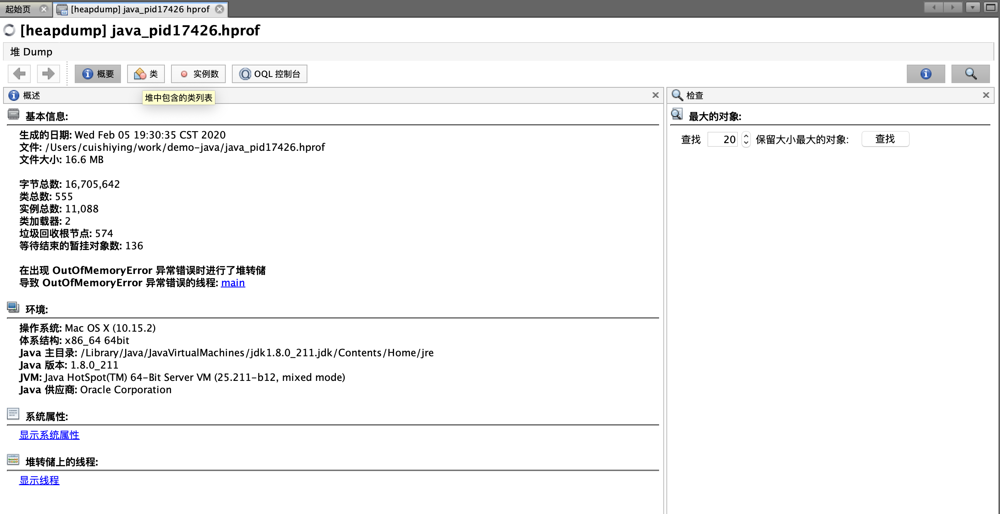

# JVM调优


## 如何生成dump文件

1. JVM的配置文件中配置：

  例如：堆初始化大小，而堆最大大小

  在应用启动时配置相关的参数 -XX:+HeapDumpOnOutOfMemoryError，当应用抛出OutOfMemoryError时生成dump文件。

  在启动的时候，配置文件在哪个目录下面：

-XX:+HeapDumpOnOutOfMemoryError -XX:HeapDumpPath=目录+产生的时间.hprof

 JVM启动时增加两个参数:

```
#出现 OOME 时生成堆 dump:
-XX:+HeapDumpOnOutOfMemoryError

#生成堆文件地址：
-XX:HeapDumpPath=/home/liuke/jvmlogs/
```

2. 发现程序异常前通过执行指令，直接生成当前JVM的dmp文件，6214是指JVM的进程号

 jmap -dump:file=文件名.dump [pid]

```
jmap -dump:format=b,file=serviceDump.dat 6214
```

由于第一种方式是一种事后方式，需要等待当前JVM出现问题后才能生成dmp文件，实时性不高，第二种方式在执行时，JVM是暂停服务的，所以对线上的运行会产生影响。所以建议第一种方式。


## 堆溢出模拟

```
/**
 * 堆溢出: java对象在堆中分配内存
 *
 * VM options: -Xms20m -Xmx20m -XX:+HeapDumpOnOutOfMemoryError
 *
 * 执行结果:
 *
 * 分配次数：1
 * 分配次数：2
 * 分配次数：3
 * java.lang.OutOfMemoryError: Java heap space
 * Dumping heap to java_pid17426.hprof ...
 * Heap dump file created [17431809 bytes in 0.026 secs]
 * Exception in thread "main" java.lang.OutOfMemoryError: Java heap space
 * 	at com.example.demojava.demo.HeapOOm.main(HeapOOm.java:15)
 */
public class HeapOOm {

    public static void main(String[] args) {
        List<byte[]> list = new ArrayList<>();
        int i=0;
        while(true){
            list.add(new byte[5*1024*1024]);
            System.out.println("分配次数："+(++i));
        }
    }
}

```

> *附：dump文件会在项目的根目录下生成*
>
> 从上面的例子我们可以看出，在进行第4次内存分配时，发生了内存溢出。


**jhat分析dump文件**

```
 jhat java_pid17426.hprof
```

这个时候访问 http://localhost:7000/ 就可以看到结果了。


**jvisualvm分析dump文件**

```
jvisualvm
```

使用方式: 点击文件->装入，在文件类型那一栏选择堆，选择要分析的dump文件java_pid17426.hprof

装入之后在界面右侧的概要、类等选项卡可以看到生成dump文件当时的堆信息：




由上图可知dump文件中记录的堆中的实例，总大小大概15M。


