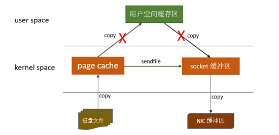

#  kafka简介

## kafka基本概念
- topic: 逻辑分组
- broke: kafka节点
- partition: 每一个Partition其实都是一个文件

## kafka使用场景

首先需要说的就是MQ的应用场景：解耦、异步、削峰

## Kafka中的ISR、AR又代表什么？ISR的伸缩又指什么

ISR:In-Sync Replicas 副本同步队列

AR:Assigned Replicas 所有副本

ISR是由leader维护，follower从leader同步数据有一些延迟
（包括延迟时间replica.lag.time.max.ms和延迟条数replica.lag.max.messages两个维度, 当前最新的版本0.10.x中只支持replica.lag.time.max.ms这个维度），
任意一个超过阈值都会把follower剔除出ISR, 存入OSR（Outof-Sync Replicas）列表，新加入的follower也会先存放在OSR中。AR=ISR+OSR。

## Kafka中是怎么体现消息顺序性的？

kafka每个partition中的消息在写入时都是有序的，消费时，每个partition只能被每一个group中的一个消费者消费，保证了消费时也是有序的。
整个topic不保证有序。如果为了保证topic整个有序，那么将partition调整为1.

## kafka为什么吞吐量大

**1. 顺序读写**

众所周知Kafka是将消息记录持久化到本地磁盘中的，一般人会认为磁盘读写性能差，可能会对Kafka性能如何保证提出质疑。
实际上不管是内存还是磁盘，快或慢关键在于寻址的方式，磁盘分为顺序读写与随机读写，内存也一样分为顺序读写与随机读写。
基于磁盘的随机读写确实很慢，但磁盘的顺序读写性能却很高，一般而言要高出磁盘随机读写三个数量级，一些情况下磁盘顺序读写性能甚至要高于内存随机读写。

磁盘的顺序读写是磁盘使用模式中最有规律的，并且操作系统也对这种模式做了大量优化，Kafka就是使用了磁盘顺序读写来提升的性能。
Kafka的message是不断追加到本地磁盘文件末尾的，而不是随机的写入，这使得Kafka写入吞吐量得到了显著提升 。

**顺序读写**有一个缺陷—— 没有办法删除数据 ，所以Kafka是不会删除数据的，它会把所有的数据都保留下来，每个消费者（Consumer）对每个Topic都有一个offset用来表示 读取到了第几条数据 。


如果不删除硬盘肯定会被撑满，所以Kakfa提供了两种策略来删除数据。一是基于时间，二是基于partition文件大小。具体配置可以参看它的配置文档。

**2. Page Cache**

为了优化读写性能，Kafka利用了操作系统本身的Page Cache，就是利用操作系统自身的内存而不是JVM空间内存。这样做的好处有：

1. 避免Object消耗：如果是使用 Java 堆，Java对象的内存消耗比较大，通常是所存储数据的两倍甚至更多。

2. 避免GC问题：随着JVM中数据不断增多，垃圾回收将会变得复杂与缓慢，使用系统缓存就不会存在GC问题

相比于使用JVM或in-memory cache等数据结构，利用操作系统的Page Cache更加简单可靠。
首先，操作系统层面的缓存利用率会更高，因为存储的都是紧凑的字节结构而不是独立的对象。
其次，操作系统本身也对于Page Cache做了大量优化，提供了 write-behind、read-ahead以及flush等多种机制。
再者，即使服务进程重启，系统缓存依然不会消失，避免了in-process cache重建缓存的过程。

通过操作系统的Page Cache，Kafka的读写操作基本上是基于内存的，读写速度得到了极大的提升。


**3. 零拷贝**

 linux操作系统 “零拷贝” 机制使用了sendfile方法， 允许操作系统将数据从Page Cache 直接发送到网络，只需要最后一步的copy操作将数据复制到 NIC 缓冲区， 这样避免重新复制数据 。示意图如下：



通过这种 “零拷贝” 的机制，Page Cache 结合 sendfile 方法，Kafka消费端的性能也大幅提升。这也是为什么有时候消费端在不断消费数据时，我们并没有看到磁盘io比较高，此刻正是操作系统缓存在提供数据。

**4. 分区分段+索引**

kafka中的topic中的内容可以被分为多分partition存在,每个partition又分为多个段segment,所以每次操作都是针对一小部分做操作，很轻便，并且增加并行操作的能力

**5. 批量读写**

kafka允许进行批量发送消息，producter发送消息的时候，可以将消息缓存在本地,等到了固定条件发送到kafka

1. 等消息条数到固定条数
2. 一段时间发送一次

**6. 批量压缩**

Kafka还支持对消息集合进行压缩，Producer可以通过GZIP或Snappy格式对消息集合进行压缩 压缩的好处就是减少传输的数据量，减轻对网络传输的压力

批量发送和数据压缩一起使用,单条做数据压缩的话，效果不明显

# kafka如何保证消息不丢失

# kafka如何保证消息不被重复消费

# Kafla实战

```shell
# 创建主题。--replication-factor副本数 --partitions分区数。消费者数<=partitions分区数，replication<=broker数
kafka-topics --create --zookeeper localhost:2181 --replication-factor 1 --partitions 3 --topic hello

# 主题列表
kafka-topics --list --zookeeper localhost:2181

# partition详情
kafka-topics --zookeeper localhost:2181 --describe --topic hello

# 生产消息
kafka-console-producer --broker-list localhost:9092 --topic hello

# 消费消息
kafka-console-consumer --bootstrap-server localhost:9092 --topic hello --from-beginning

# 查看消费组
kafka-consumer-groups --bootstrap-server localhost:9092 --list

# 显示某个消费组的消费详情（0.10.1.0版本+）
kafka-consumer-groups --bootstrap-server localhost:9092 --describe --group my-group

# 查看kafka索引文件
kafka-run-class kafka.tools.DumpLogSegments --files /usr/local/var/lib/kafka-logs/test-0/00000000000000000000.log  --print-data-log

# 查看kafka日志文件
kafka-run-class kafka.tools.DumpLogSegments --files /usr/local/var/lib/kafka-logs/test-0/00000000000000000000.index

kafka-run-class kafka.tools.DumpLogSegments --files /usr/local/var/lib/kafka-logs/test-0/00000000000000000000.timeindex  --verify-index-only

# 默认kafka配置文件mac
/usr/local/etc/kafka/server.properties
/usr/local/etc/kafka/zookeeper.properties

# zk默认配置文件
/usr/local/etc/zookeeper/zoo.cfg

# kafka日志文件默认位置
/usr/local/var/lib/kafka-logs

# zk默认文件位置
/usr/local/var/run/zookeeper/data
```

kafka的元数据存储在zookeeper中。通过zkCli命令课连接zk操作。

```shell
# 查看zookeeper文件目录
ls /
# 获取zookeeper文件内容
get /
```

获取zookeeper示例

```shell
# 获取zk根目录
[zk: localhost:2181(CONNECTED) 24] ls /
[cluster, controller_epoch, controller, brokers, zookeeper, admin, isr_change_notification, consumers, log_dir_event_notification, latest_producer_id_block, config]

# 获取kafka中partition配置
[zk: localhost:2181(CONNECTED) 23] ls /brokers/topics/hello/partitions
[0, 1, 2]
```

下边是查看kafka数据的存储。在/usr/local/var/lib/kafka-logs目录下。可以看到hello中的3个partition文件夹。

```shell
# 目录结构，其中 __consumer_offsets中存储consumer的消费offset，hello-存储消息，消息在3个partition均匀分步。每个partition一个文件夹，每个文件夹下多个segment，每个segment为一个文件

drwxr-xr-x  6 cuishiying  admin   192B 12 31 13:45 __consumer_offsets-0
drwxr-xr-x  6 cuishiying  admin   192B 12 31 13:45 __consumer_offsets-1
drwxr-xr-x  6 cuishiying  admin   192B 12 31 13:45 __consumer_offsets-10
drwxr-xr-x  7 cuishiying  admin   224B 12 31 13:45 __consumer_offsets-11
drwxr-xr-x  6 cuishiying  admin   192B 12 31 13:45 __consumer_offsets-12
drwxr-xr-x  6 cuishiying  admin   192B 12 31 13:45 __consumer_offsets-13
drwxr-xr-x  6 cuishiying  admin   192B 12 31 13:45 __consumer_offsets-14
drwxr-xr-x  6 cuishiying  admin   192B 12 31 13:45 __consumer_offsets-15
drwxr-xr-x  6 cuishiying  admin   192B 12 31 13:45 __consumer_offsets-16
drwxr-xr-x  6 cuishiying  admin   192B 12 31 13:45 __consumer_offsets-17
drwxr-xr-x  6 cuishiying  admin   192B 12 31 13:45 __consumer_offsets-18
drwxr-xr-x  6 cuishiying  admin   192B 12 31 13:45 __consumer_offsets-19
drwxr-xr-x  6 cuishiying  admin   192B 12 31 13:45 __consumer_offsets-2
drwxr-xr-x  6 cuishiying  admin   192B 12 31 13:45 __consumer_offsets-20
drwxr-xr-x  6 cuishiying  admin   192B 12 31 13:45 __consumer_offsets-21
drwxr-xr-x  7 cuishiying  admin   224B 12 31 13:45 __consumer_offsets-22
drwxr-xr-x  6 cuishiying  admin   192B 12 31 13:45 __consumer_offsets-23
drwxr-xr-x  6 cuishiying  admin   192B 12 31 13:45 __consumer_offsets-24
drwxr-xr-x  6 cuishiying  admin   192B 12 31 13:45 __consumer_offsets-25
drwxr-xr-x  6 cuishiying  admin   192B 12 31 13:45 __consumer_offsets-26
drwxr-xr-x  6 cuishiying  admin   192B 12 31 13:45 __consumer_offsets-27
drwxr-xr-x  6 cuishiying  admin   192B 12 31 13:45 __consumer_offsets-28
drwxr-xr-x  6 cuishiying  admin   192B 12 31 13:45 __consumer_offsets-29
drwxr-xr-x  6 cuishiying  admin   192B 12 31 13:45 __consumer_offsets-3
drwxr-xr-x  6 cuishiying  admin   192B 12 31 13:45 __consumer_offsets-30
drwxr-xr-x  6 cuishiying  admin   192B 12 31 13:45 __consumer_offsets-31
drwxr-xr-x  6 cuishiying  admin   192B 12 31 13:45 __consumer_offsets-32
drwxr-xr-x  6 cuishiying  admin   192B 12 31 13:45 __consumer_offsets-33
drwxr-xr-x  6 cuishiying  admin   192B 12 31 13:45 __consumer_offsets-34
drwxr-xr-x  6 cuishiying  admin   192B 12 31 13:45 __consumer_offsets-35
drwxr-xr-x  6 cuishiying  admin   192B 12 31 13:45 __consumer_offsets-36
drwxr-xr-x  6 cuishiying  admin   192B 12 31 13:45 __consumer_offsets-37
drwxr-xr-x  6 cuishiying  admin   192B 12 31 13:45 __consumer_offsets-38
drwxr-xr-x  6 cuishiying  admin   192B 12 31 13:45 __consumer_offsets-39
drwxr-xr-x  6 cuishiying  admin   192B 12 31 13:45 __consumer_offsets-4
drwxr-xr-x  6 cuishiying  admin   192B 12 31 13:45 __consumer_offsets-40
drwxr-xr-x  6 cuishiying  admin   192B 12 31 13:45 __consumer_offsets-41
drwxr-xr-x  6 cuishiying  admin   192B 12 31 13:45 __consumer_offsets-42
drwxr-xr-x  6 cuishiying  admin   192B 12 31 13:45 __consumer_offsets-43
drwxr-xr-x  6 cuishiying  admin   192B 12 31 13:45 __consumer_offsets-44
drwxr-xr-x  6 cuishiying  admin   192B 12 31 13:45 __consumer_offsets-45
drwxr-xr-x  6 cuishiying  admin   192B 12 31 13:45 __consumer_offsets-46
drwxr-xr-x  6 cuishiying  admin   192B 12 31 13:45 __consumer_offsets-47
drwxr-xr-x  6 cuishiying  admin   192B 12 31 13:45 __consumer_offsets-48
drwxr-xr-x  6 cuishiying  admin   192B 12 31 13:45 __consumer_offsets-49
drwxr-xr-x  6 cuishiying  admin   192B 12 31 13:45 __consumer_offsets-5
drwxr-xr-x  6 cuishiying  admin   192B 12 31 13:45 __consumer_offsets-6
drwxr-xr-x  6 cuishiying  admin   192B 12 31 13:45 __consumer_offsets-7
drwxr-xr-x  6 cuishiying  admin   192B 12 31 13:45 __consumer_offsets-8
drwxr-xr-x  6 cuishiying  admin   192B 12 31 13:45 __consumer_offsets-9
-rw-r--r--  1 cuishiying  admin     0B  6  7  2018 cleaner-offset-checkpoint
drwxr-xr-x  6 cuishiying  admin   192B 12 31 13:45 hello-0
drwxr-xr-x  6 cuishiying  admin   192B 12 31 13:45 hello-1
drwxr-xr-x  6 cuishiying  admin   192B 12 31 13:45 hello-2

# 查看消息
kafka-run-class kafka.tools.DumpLogSegments --files /usr/local/var/lib/kafka-logs/hello-1/00000000000000000000.log --print-data-log

# 以下是topic数据，每个partition中的消息都由offset=0开始记录消息，offset在partition中的编号唯一
Dumping /usr/local/var/lib/kafka-logs/hello-1/00000000000000000000.log
Starting offset: 0
baseOffset: 0 lastOffset: 0 count: 1 baseSequence: -1 lastSequence: -1 producerId: -1 producerEpoch: -1 partitionLeaderEpoch: 0 isTransactional: false isControl: false position: 0 CreateTime: 1577779908036 size: 70 magic: 2 compresscodec: NONE crc: 542998495 isvalid: true
| offset: 0 CreateTime: 1577779908036 keysize: -1 valuesize: 2 sequence: -1 headerKeys: [] payload: aa
baseOffset: 1 lastOffset: 1 count: 1 baseSequence: -1 lastSequence: -1 producerId: -1 producerEpoch: -1 partitionLeaderEpoch: 0 isTransactional: false isControl: false position: 70 CreateTime: 1577779912096 size: 70 magic: 2 compresscodec: NONE crc: 871859124 isvalid: true
| offset: 1 CreateTime: 1577779912096 keysize: -1 valuesize: 2 sequence: -1 headerKeys: [] payload: dd
```


