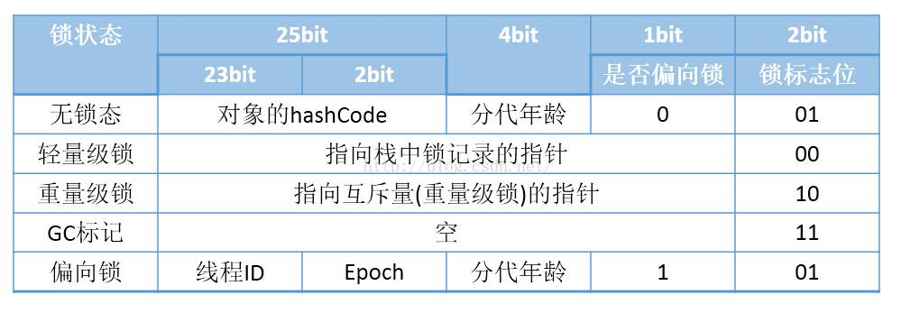
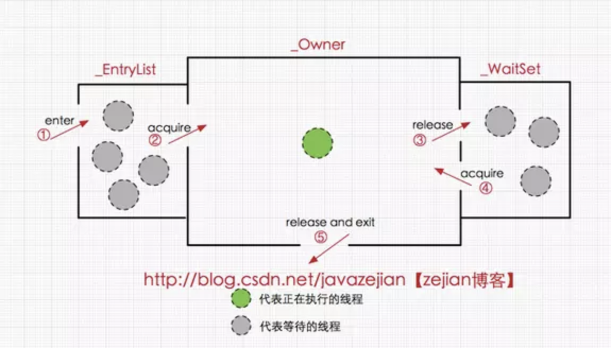
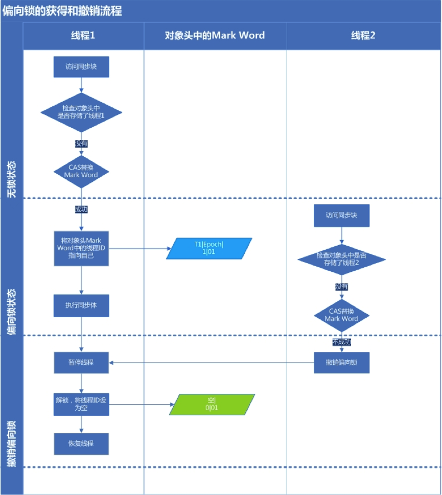
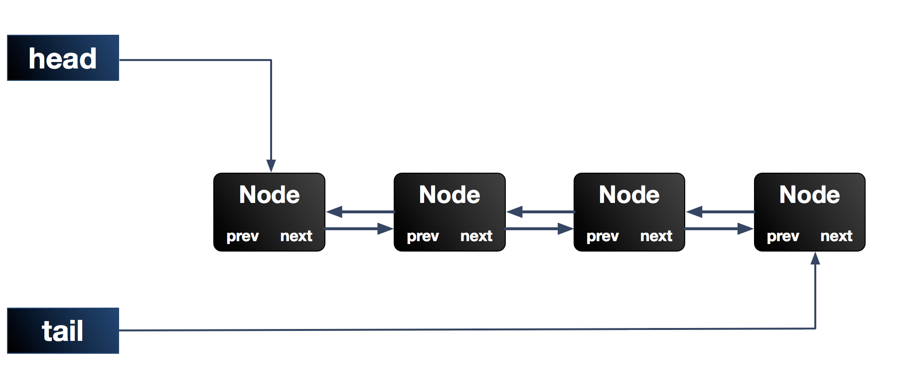

# 面试-并发编程

## 1. syncronized原理

synchronized 是由一对 monitorenter/monitorexit 指令实现的，monitor 对象是同步的基本实现单元。
monitor 的实现完全是依靠操作系统内部的互斥锁Mutex Lock，需要进行用户态到内核态的切换。

> 在JVM中，对象在内存中的布局分为三块区域：对象头、实例变量和填充数据。Hotspot虚拟机的对象头主要包括两部分数据：Mark Word（标记字段）、Klass Pointer（类型指针）。其中Mark Word用于存储对象自身的运行时数据，如哈希码（HashCode）、GC分代年龄、锁状态标志、线程持有的锁、偏向线程 ID、偏向时间戳等等。



关于这两条指令的作用，我们直接参考JVM规范中描述：

monitorenter:
每个对象有一个监视器锁（monitor）。当monitor被占用时就会处于锁定状态，线程执行monitorenter指令时尝试获取monitor的所有权，过程如下：
1、如果monitor的进入数为0，则该线程进入monitor，然后将进入数设置为1，该线程即为monitor的所有者。
2、如果线程已经占有该monitor，只是重新进入，则进入monitor的进入数加1.
3.如果其他线程已经占用了monitor，则该线程进入阻塞状态，直到monitor的进入数为0，再重新尝试获取monitor的所有权。

monitorexit:
执行monitorexit的线程必须是objectref所对应的monitor的所有者。
指令执行时，monitor的进入数减1，如果减1后进入数为0，那线程退出monitor，不再是这个monitor的所有者。其他被这个monitor阻塞的线程可以尝试去获取这个 monitor 的所有权。 

在Java虚拟机(HotSpot)中，monitor是由ObjectMonitor实现的
ObjectMonitor中有两个队列，_WaitSet和_EntryList，用来保存ObjectWaiter对象列表(每个等待锁的线程都会被封装成ObjectWaiter对象)，_owner指向持有ObjectMonitor对象的线程，当多个线程同时访问一段同步代码时，首先会进入 _EntryList 集合，当线程获取到对象的monitor 后进入 _Owner 区域并把monitor中的owner变量设置为当前线程同时monitor中的计数器count加1，若线程调用wait()方法，将释放当前持有的monitor，owner变量恢复为null，count自减1，同时该线程进入WaitSet集合中等待被唤醒。若当前线程执行完毕也将释放monitor(锁)并复位变量的值，以便其他线程进入获取monitor(锁)。如下图所示:




### 1.1 案例

syncronized可修饰方法，代码块，类，静态方法。修饰方法和代码块锁定的是当前对象。修饰类和静态方法锁定的是当前类。

案例一

```java
@Slf4j
public class SynchronizedExample1 {

    // 修饰一个代码块
    public void test1(int j) {
        synchronized (this) {
            for (int i = 0; i < 10; i++) {
                log.info("test1 {} - {}", j, i);
            }
        }
    }

    // 修饰一个方法
    public synchronized void test2(int j) {
        for (int i = 0; i < 10; i++) {
            log.info("test2 {} - {}", j, i);
        }
    }

    public static void main(String[] args) {
        SynchronizedExample1 example1 = new SynchronizedExample1();
        SynchronizedExample1 example2 = new SynchronizedExample1();
        ExecutorService executorService = Executors.newCachedThreadPool();
        executorService.execute(() -> {
            example1.test2(1);
        });
        executorService.execute(() -> {
            example2.test2(2);
        });
    }
}
```

运行结果

```
15:56:52.977 [pool-1-thread-2] INFO com.example.demojava.demo.SynchronizedExample1 - test2 2 - 0
15:56:52.977 [pool-1-thread-1] INFO com.example.demojava.demo.SynchronizedExample1 - test2 1 - 0
15:56:52.994 [pool-1-thread-2] INFO com.example.demojava.demo.SynchronizedExample1 - test2 2 - 1
15:56:52.994 [pool-1-thread-1] INFO com.example.demojava.demo.SynchronizedExample1 - test2 1 - 1
15:56:52.994 [pool-1-thread-2] INFO com.example.demojava.demo.SynchronizedExample1 - test2 2 - 2
15:56:52.994 [pool-1-thread-1] INFO com.example.demojava.demo.SynchronizedExample1 - test2 1 - 2
15:56:52.994 [pool-1-thread-2] INFO com.example.demojava.demo.SynchronizedExample1 - test2 2 - 3
15:56:52.994 [pool-1-thread-1] INFO com.example.demojava.demo.SynchronizedExample1 - test2 1 - 3
15:56:52.995 [pool-1-thread-1] INFO com.example.demojava.demo.SynchronizedExample1 - test2 1 - 4
15:56:52.995 [pool-1-thread-2] INFO com.example.demojava.demo.SynchronizedExample1 - test2 2 - 4
15:56:52.995 [pool-1-thread-1] INFO com.example.demojava.demo.SynchronizedExample1 - test2 1 - 5
15:56:52.995 [pool-1-thread-2] INFO com.example.demojava.demo.SynchronizedExample1 - test2 2 - 5
15:56:52.995 [pool-1-thread-1] INFO com.example.demojava.demo.SynchronizedExample1 - test2 1 - 6
15:56:52.995 [pool-1-thread-2] INFO com.example.demojava.demo.SynchronizedExample1 - test2 2 - 6
15:56:52.995 [pool-1-thread-1] INFO com.example.demojava.demo.SynchronizedExample1 - test2 1 - 7
15:56:52.995 [pool-1-thread-2] INFO com.example.demojava.demo.SynchronizedExample1 - test2 2 - 7
15:56:52.995 [pool-1-thread-1] INFO com.example.demojava.demo.SynchronizedExample1 - test2 1 - 8
15:56:52.995 [pool-1-thread-2] INFO com.example.demojava.demo.SynchronizedExample1 - test2 2 - 8
15:56:52.995 [pool-1-thread-1] INFO com.example.demojava.demo.SynchronizedExample1 - test2 1 - 9
15:56:52.995 [pool-1-thread-2] INFO com.example.demojava.demo.SynchronizedExample1 - test2 2 - 9

```


案例二

```java
@Slf4j
public class SynchronizedExample2 {

    // 修饰一个类
    public static void test1(int j) {
        synchronized (SynchronizedExample2.class) {
            for (int i = 0; i < 10; i++) {
                log.info("test1 {} - {}", j, i);
            }
        }
    }

    // 修饰一个静态方法
    public static synchronized void test2(int j) {
        for (int i = 0; i < 10; i++) {
            log.info("test2 {} - {}", j, i);
        }
    }

    public static void main(String[] args) {
        SynchronizedExample2 example1 = new SynchronizedExample2();
        SynchronizedExample2 example2 = new SynchronizedExample2();
        ExecutorService executorService = Executors.newCachedThreadPool();
        executorService.execute(() -> {
            example1.test2(1);
        });
        executorService.execute(() -> {
            example2.test2(2);
        });
    }
}
```

运行结果

```
16:02:55.785 [pool-1-thread-1] INFO com.example.demojava.demo.SynchronizedExample2 - test2 1 - 0
16:02:55.791 [pool-1-thread-1] INFO com.example.demojava.demo.SynchronizedExample2 - test2 1 - 1
16:02:55.791 [pool-1-thread-1] INFO com.example.demojava.demo.SynchronizedExample2 - test2 1 - 2
16:02:55.791 [pool-1-thread-1] INFO com.example.demojava.demo.SynchronizedExample2 - test2 1 - 3
16:02:55.791 [pool-1-thread-1] INFO com.example.demojava.demo.SynchronizedExample2 - test2 1 - 4
16:02:55.791 [pool-1-thread-1] INFO com.example.demojava.demo.SynchronizedExample2 - test2 1 - 5
16:02:55.791 [pool-1-thread-1] INFO com.example.demojava.demo.SynchronizedExample2 - test2 1 - 6
16:02:55.791 [pool-1-thread-1] INFO com.example.demojava.demo.SynchronizedExample2 - test2 1 - 7
16:02:55.791 [pool-1-thread-1] INFO com.example.demojava.demo.SynchronizedExample2 - test2 1 - 8
16:02:55.791 [pool-1-thread-1] INFO com.example.demojava.demo.SynchronizedExample2 - test2 1 - 9
16:02:55.791 [pool-1-thread-2] INFO com.example.demojava.demo.SynchronizedExample2 - test2 2 - 0
16:02:55.791 [pool-1-thread-2] INFO com.example.demojava.demo.SynchronizedExample2 - test2 2 - 1
16:02:55.791 [pool-1-thread-2] INFO com.example.demojava.demo.SynchronizedExample2 - test2 2 - 2
16:02:55.792 [pool-1-thread-2] INFO com.example.demojava.demo.SynchronizedExample2 - test2 2 - 3
16:02:55.792 [pool-1-thread-2] INFO com.example.demojava.demo.SynchronizedExample2 - test2 2 - 4
16:02:55.792 [pool-1-thread-2] INFO com.example.demojava.demo.SynchronizedExample2 - test2 2 - 5
16:02:55.792 [pool-1-thread-2] INFO com.example.demojava.demo.SynchronizedExample2 - test2 2 - 6
16:02:55.792 [pool-1-thread-2] INFO com.example.demojava.demo.SynchronizedExample2 - test2 2 - 7
16:02:55.792 [pool-1-thread-2] INFO com.example.demojava.demo.SynchronizedExample2 - test2 2 - 8
16:02:55.792 [pool-1-thread-2] INFO com.example.demojava.demo.SynchronizedExample2 - test2 2 - 9
```


## 2.JVM 对 Java 的原生锁做了哪些优化

monitor是基于底层操作系统的Mutex Lock实现的，而基于Mutex Lock实现的同步必须经历从用户态到核心态的转换，这个开销特别大，成本非常高。所以频繁的通过Synchronized实现同步会严重影响到程序效率，而这种依赖于Mutex Lock实现的锁机制也被称为“重量级锁”，为了减少重量级锁带来的性能开销，JDK1.6对Synchronized进行了种种优化。引入了偏向锁和轻量级锁。

synchronized 锁升级原理：在锁对象的对象头里面有一个 threadid 字段，在第一次访问的时候 threadid 为空，jvm 让其持有偏向锁，并通过CAS将对象头Mark Word中的 threadid 设置为其线程 id，再次进入的时候会先判断 threadid 是否与其线程 id 一致，如果一致则可以直接使用此对象，如果不一致，则升级偏向锁为轻量级锁，通过CAS自旋循环一定次数来获取锁，执行一定次数之后，如果还没有正常获取到要使用的对象，此时就会把锁从轻量级升级为重量级锁，此过程就构成了 synchronized 锁的升级。

偏向所锁，轻量级锁都是乐观锁，重量级锁是悲观锁。

### 2.1 偏向锁



**获取锁**：

1. 检测Mark Word是否为可偏向状态，即是否为偏向锁1，锁标识位为01；
2. 若为可偏向状态，则测试线程ID是否为当前线程ID，如果是，则执行步骤（5），否则执行步骤（3）；
3. 如果线程ID不为当前线程ID，则通过CAS操作竞争锁，竞争成功，则将Mark Word的线程ID替换为当前线程ID，否则执行线程（4）；
4. 通过CAS竞争锁失败，证明当前存在多线程竞争情况，当到达全局安全点，获得偏向锁的线程被挂起，偏向锁升级为轻量级锁，然后被阻塞在安全点的线程继续往下执行同步代码块；
5. 执行同步代码块

**释放锁**： 偏向锁的释放采用了一种只有竞争才会释放锁的机制，线程是不会主动去释放偏向锁，需要等待其他线程来竞争。偏向锁的撤销需要等待全局安全点（这个时间点是上没有正在执行的代码）。其步骤如下：

1. 暂停拥有偏向锁的线程，判断锁对象石是否还处于被锁定状态；
2. 撤销偏向苏，恢复到无锁状态（01）或者轻量级锁的状态；

### 2.2 轻量级锁


**获取锁**：

1. 判断当前对象是否处于无锁状态（hashcode、0、01），若是，则JVM首先将在当前线程的栈帧中建立一个名为锁记录（Lock Record）的空间，用于存储锁对象目前的Mark Word的拷贝（官方把这份拷贝加了一个Displaced前缀，即Displaced Mark Word）；否则执行步骤（3）；
2. JVM利用CAS操作尝试将对象的Mark Word更新为指向Lock Record的指正，如果成功表示竞争到锁，则将锁标志位变成00（表示此对象处于轻量级锁状态），执行同步操作；如果失败则执行步骤（3）；
3. 判断当前对象的Mark Word是否指向当前线程的栈帧，如果是则表示当前线程已经持有当前对象的锁，则直接执行同步代码块；否则只能说明该锁对象已经被其他线程抢占了，这时轻量级锁需要膨胀为重量级锁，锁标志位变成10，后面等待的线程将会进入阻塞状态；

**释放锁**： 轻量级锁的释放也是通过CAS操作来进行的，主要步骤如下：

1. 取出在获取轻量级锁保存在Displaced Mark Word中的数据；
2. 用CAS操作将取出的数据替换当前对象的Mark Word中，如果成功，则说明释放锁成功，否则执行（3）；
3. 如果CAS操作替换失败，说明有其他线程尝试获取该锁，则需要在释放锁的同时需要唤醒被挂起的线程。

### 2.3 锁膨胀过程


## 3. ReenTrantLock

ReentrantLock就是通过重写了AQS的tryAcquire和tryRelease方法实现的lock和unlock


首先ReentrantLock继承自父类Lock，然后有3个内部类，其中Sync内部类继承自AQS，另外的两个内部类继承自Sync，这两个类分别是用来**公平锁和非公平锁**的。

通过Sync重写的方法tryAcquire、tryRelease可以知道，ReentrantLock实现的是AQS的独占模式，也就是独占锁，这个锁是悲观锁。

公平锁中，每一次的tryAcquire都会检查CLH队列中是否仍有前驱的元素，如果仍然有那么继续等待，通过这种方式来保证先来先服务的原则；而非公平锁，首先是检查并设置锁的状态，这种方式会出现即使队列中有等待的线程，但是新的线程仍然会与排队线程中的对头线程竞争（但是排队的线程是先来先服务的），所以新的线程可能会抢占已经在排队的线程的锁，这样就无法保证先来先服务，但是已经等待的线程们是仍然保证先来先服务的，所以总结一下公平锁和非公平锁的区别：

**1、公平锁能保证：老的线程排队使用锁，新线程仍然排队使用锁。**
**2、非公平锁保证：老的线程排队使用锁；但是无法保证新线程抢占已经在排队的线程的锁。**

### 3.1 非公平锁的实现原理

**lock方法获取锁**

```java
final void lock() {
    //CAS操作设置state的值
    if (compareAndSetState(0, 1))
        //设置成功 直接将锁的所有者设置为当前线程 流程结束
        setExclusiveOwnerThread(Thread.currentThread());
    else
        //设置失败 则进行后续的加入同步队列准备
        acquire(1);
}

public final void acquire(int arg) {
    //调用子类重写的tryAcquire方法 如果tryAcquire方法返回false 那么线程就会进入同步队列。
    if (!tryAcquire(arg) &&
        acquireQueued(addWaiter(Node.EXCLUSIVE), arg))
        selfInterrupt();
}

//子类重写的tryAcquire方法
protected final boolean tryAcquire(int acquires) {
    //调用nonfairTryAcquire方法
    return nonfairTryAcquire(acquires);
}

final boolean nonfairTryAcquire(int acquires) {
    final Thread current = Thread.currentThread();
    int c = getState();
    //如果状态state=0，即在这段时间内 锁的所有者把锁释放了 那么这里state就为0
    if (c == 0) {
        //使用CAS操作设置state的值
        if (compareAndSetState(0, acquires)) {
            //操作成功 则将锁的所有者设置成当前线程 且返回true，也就是当前线程不会进入同步
            //队列。
            setExclusiveOwnerThread(current);
            return true;
        }
    }
    //如果状态state不等于0，也就是有线程正在占用锁，那么先检查一下这个线程是不是自己
    else if (current == getExclusiveOwnerThread()) {
        //如果线程就是自己了，那么直接将state+1，返回true，不需要再获取锁 因为锁就在自己
        //身上了。
        int nextc = c + acquires;
        if (nextc < 0) // overflow
            throw new Error("Maximum lock count exceeded");
        setState(nextc);
        return true;
    }
    //如果state不等于0，且锁的所有者又不是自己，那么线程就会进入到同步队列。
    return false;
}

```


**tryRelease锁的释放**

```java
public void unlock() {
    sync.release(1);
}

public final boolean release(int arg) {
    //子类重写的tryRelease方法，需要等锁的state=0，即tryRelease返回true的时候，才会去唤醒其
    //它线程进行尝试获取锁。
    if (tryRelease(arg)) {
        Node h = head;
        if (h != null && h.waitStatus != 0)
            unparkSuccessor(h);
        return true;
    }
    return false;
}
    
protected final boolean tryRelease(int releases) {
    //状态的state减去releases
    int c = getState() - releases;
    //判断锁的所有者是不是该线程
    if (Thread.currentThread() != getExclusiveOwnerThread())
        //如果所的所有者不是该线程 则抛出异常 也就是锁释放的前提是线程拥有这个锁，
        throw new IllegalMonitorStateException();
    boolean free = false;
    //如果该线程释放锁之后 状态state=0，即锁没有重入，那么直接将将锁的所有者设置成null
    //并且返回true，即代表可以唤醒其他线程去获取锁了。如果该线程释放锁之后state不等于0，
    //那么代表锁重入了，返回false，代表锁还未正在释放，不用去唤醒其他线程。
    if (c == 0) {
        free = true;
        setExclusiveOwnerThread(null);
    }
    setState(c);
    return free;
}
```

### 3.2 公平锁实现原理

**lock方法获取锁**

1. 获取状态的state的值，如果state=0即代表锁没有被其它线程占用(但是并不代表同步队列没有线程在等待)，执行步骤2。如果state!=0则代表锁正在被其它线程占用，执行步骤3。
2. 判断同步队列是否存在线程(节点)，如果不存在则直接将锁的所有者设置成当前线程，且更新状态state，然后返回true。
3. 判断锁的所有者是不是当前线程，如果是则更新状态state的值，然后返回true，如果不是，那么返回false，即线程会被加入到同步队列中

```java
final void lock() {
    acquire(1);
}

public final void acquire(int arg) {
    //同步队列中有线程 且 锁的所有者不是当前线程那么将线程加入到同步队列的尾部，
    //保证了公平性，也就是先来的线程先获得锁，后来的不能抢先获取。
    if (!tryAcquire(arg) &&
        acquireQueued(addWaiter(Node.EXCLUSIVE), arg))
        selfInterrupt();
}

protected final boolean tryAcquire(int acquires) {
    final Thread current = Thread.currentThread();
    int c = getState();
    //判断状态state是否等于0，等于0代表锁没有被占用，不等于0则代表锁被占用着。
    if (c == 0) {
        //调用hasQueuedPredecessors方法判断同步队列中是否有线程在等待，如果同步队列中没有
        //线程在等待 则当前线程成为锁的所有者，如果同步队列中有线程在等待，则继续往下执行
        //这个机制就是公平锁的机制，也就是先让先来的线程获取锁，后来的不能抢先获取。
        if (!hasQueuedPredecessors() &&
            compareAndSetState(0, acquires)) {
            setExclusiveOwnerThread(current);
            return true;
        }
    }
    //判断当前线程是否为锁的所有者，如果是，那么直接更新状态state，然后返回true。
    else if (current == getExclusiveOwnerThread()) {
        int nextc = c + acquires;
        if (nextc < 0)
            throw new Error("Maximum lock count exceeded");
        setState(nextc);
        return true;
    }
    //如果同步队列中有线程存在 且 锁的所有者不是当前线程，则返回false。
    return false;
}
```

### 3.3 实例

ReentrantLock案例

```java
public class LockExample2 {

    // 请求总数
    public static int clientTotal = 5000;

    // 同时并发执行的线程数
    public static int threadTotal = 200;

    public static int count = 0;

    private final static Lock lock = new ReentrantLock();

    public static void main(String[] args) throws Exception {
        ExecutorService executorService = Executors.newCachedThreadPool();
        final Semaphore semaphore = new Semaphore(threadTotal);
        final CountDownLatch countDownLatch = new CountDownLatch(clientTotal);
        for (int i = 0; i < clientTotal ; i++) {
            executorService.execute(() -> {
                try {
                    semaphore.acquire();
                    add();
                    semaphore.release();
                } catch (Exception e) {
                    log.error("exception", e);
                }
                countDownLatch.countDown();
            });
        }
        countDownLatch.await();
        executorService.shutdown();
        log.info("count:{}", count);
    }

    private static void add() {
        lock.lock();
        try {
            count++;
        } finally {
            lock.unlock();
        }
    }
}
```

ReentrantReadWriteLock案例：

```java
@Slf4j
public class LockExample3 {

    private final Map<String, String> map = new TreeMap<>();

    private final ReentrantReadWriteLock lock = new ReentrantReadWriteLock();

    // 共享锁(读锁)
    private final Lock readLock = lock.readLock();

    // 独占锁(写锁)
    private final Lock writeLock = lock.writeLock();

    public String get(String key) {
        readLock.lock();
        try {
            System.out.println(Thread.currentThread().getName() + "准备读数据");
            Thread.sleep(3000);
            System.out.println(Thread.currentThread().getName() + "读取了数据");
            return map.get(key);
        } catch (InterruptedException e) {
            e.printStackTrace();
            return null;
        } finally {
            readLock.unlock();
        }
    }

    public Set<String> getAllKeys() {
        readLock.lock();
        try {
            return map.keySet();
        } finally {
            readLock.unlock();
        }
    }

    public String put(String key, String value) {
        writeLock.lock();
        try {
            System.out.println(Thread.currentThread().getName() + "准备写数据");
            Thread.sleep(3000);
            System.out.println(Thread.currentThread().getName() + "写了数据");
            return map.put(key, value);
        } catch (InterruptedException e) {
            e.printStackTrace();
            return null;
        } finally {
            writeLock.unlock();
        }
    }


    public static void main(String[] args) {
        LockExample3 lockExample3 = new LockExample3();

        ExecutorService readExecutor = Executors.newFixedThreadPool(3);
        for (int i=0; i<5; i++) {
            readExecutor.execute(() -> {
                lockExample3.get("aaa");
            });
        }


        ExecutorService writeExecutor = Executors.newFixedThreadPool(3);
        for (int i=0; i<5; i++) {
            writeExecutor.execute(() -> {
                lockExample3.put("aaa", "b");
            });
        }

        readExecutor.shutdown();
        writeExecutor.shutdown();

    }
}
```

Java1.8引入了一个新锁StampedLock，这个锁可以认为是ReadWriteLock的改进。

我们知道在ReadWriteLock中写和读是互斥的，也就是如果有一个线程在写共享变量的话，其他线程读共享变量都会阻塞。同时在读线程非常多而写线程比较少的情况下，写线程可能发生饥饿现象，也就是因为大量的读线程存在并且读线程都阻塞写线程。

StampedLock把读分为了悲观读和乐观读，悲观读就等价于ReadWriteLock的读，而乐观读在一个线程写共享变量时，不会被阻塞，乐观读是不加锁的。

该锁提供了三种模式的读写控制，三种模式分别如下：

- 写锁writeLock，是个排它锁或者叫独占锁，同时只有一个线程可以获取该锁，当一个线程获取该锁后，其它请求的线程必须等待，当目前没有线程持有读锁或者写锁的时候才可以获取到该锁，请求该锁成功后会返回一个stamp票据变量用来表示该锁的版本，当释放该锁时候需要unlockWrite并传递参数stamp。

- 悲观读锁readLock，是个共享锁，在没有线程获取独占写锁的情况下，同时多个线程可以获取该锁，如果已经有线程持有写锁，其他线程请求获取该读锁会被阻塞。这里讲的悲观其实是参考数据库中的乐观悲观锁的，这里说的悲观是说在具体操作数据前悲观的认为其他线程可能要对自己操作的数据进行修改，所以需要先对数据加锁，这是在读少写多的情况下的一种考虑,请求该锁成功后会返回一个stamp票据变量用来表示该锁的版本，当释放该锁时候需要unlockRead并传递参数stamp。

- 乐观读锁tryOptimisticRead，是相对于悲观锁来说的，在操作数据前并没有通过CAS设置锁的状态，如果当前没有线程持有写锁，则简单的返回一个非0的stamp版本信息，获取该stamp后在具体操作数据前还需要调用validate验证下该stamp是否已经不可用，也就是看当调用tryOptimisticRead返回stamp后到到当前时间间是否有其他线程持有了写锁，如果是那么validate会返回0，否者就可以使用该stamp版本的锁对数据进行操作。由于tryOptimisticRead并没有使用CAS设置锁状态所以不需要显示的释放该锁。该锁的一个特点是适用于读多写少的场景，因为获取读锁只是使用与或操作进行检验，不涉及CAS操作，所以效率会高很多，但是同时由于没有使用真正的锁，在保证数据一致性上需要拷贝一份要操作的变量到方法栈，并且在操作数据时候可能其他写线程已经修改了数据，而我们操作的是方法栈里面的数据，也就是一个快照，所以最多返回的不是最新的数据，但是一致性还是得到保障的。

StampedLock案例:

```java
public class LockExample4 {

    class Point {
        private double x, y;
        private final StampedLock sl = new StampedLock();

        void move(double deltaX, double deltaY) { // an exclusively locked method
            long stamp = sl.writeLock();
            try {
                x += deltaX;
                y += deltaY;
            } finally {
                sl.unlockWrite(stamp);
            }
        }

        //下面看看乐观读锁案例
        double distanceFromOrigin() { // A read-only method
            long stamp = sl.tryOptimisticRead(); //获得一个乐观读锁
            double currentX = x, currentY = y;  //将两个字段读入本地局部变量
            if (!sl.validate(stamp)) { //检查发出乐观读锁后同时是否有其他写锁发生？
                stamp = sl.readLock();  //如果没有，我们再次获得一个读悲观锁
                try {
                    currentX = x; // 将两个字段读入本地局部变量
                    currentY = y; // 将两个字段读入本地局部变量
                } finally {
                    sl.unlockRead(stamp);
                }
            }
            return Math.sqrt(currentX * currentX + currentY * currentY);
        }

        //下面是悲观读锁案例
        void moveIfAtOrigin(double newX, double newY) { // upgrade
            // Could instead start with optimistic, not read mode
            long stamp = sl.readLock();
            try {
                while (x == 0.0 && y == 0.0) { //循环，检查当前状态是否符合
                    long ws = sl.tryConvertToWriteLock(stamp); //将读锁转为写锁
                    if (ws != 0L) { //这是确认转为写锁是否成功
                        stamp = ws; //如果成功 替换票据
                        x = newX; //进行状态改变
                        y = newY;  //进行状态改变
                        break;
                    } else { //如果不能成功转换为写锁
                        sl.unlockRead(stamp);  //我们显式释放读锁
                        stamp = sl.writeLock();  //显式直接进行写锁 然后再通过循环再试
                    }
                }
            } finally {
                sl.unlock(stamp); //释放读锁或写锁
            }
        }
    }
}
```


```java
public class LockExample5 {

    // 请求总数
    public static int clientTotal = 5000;

    // 同时并发执行的线程数
    public static int threadTotal = 200;

    public static int count = 0;

    private final static StampedLock lock = new StampedLock();

    public static void main(String[] args) throws Exception {
        ExecutorService executorService = Executors.newCachedThreadPool();
        final Semaphore semaphore = new Semaphore(threadTotal);
        final CountDownLatch countDownLatch = new CountDownLatch(clientTotal);
        for (int i = 0; i < clientTotal ; i++) {
            executorService.execute(() -> {
                try {
                    semaphore.acquire();
                    add();
                    semaphore.release();
                } catch (Exception e) {
                    log.error("exception", e);
                }
                countDownLatch.countDown();
            });
        }
        countDownLatch.await();
        executorService.shutdown();
        log.info("count:{}", count);
    }

    private static void add() {
        long stamp = lock.writeLock();
        try {
            count++;
        } finally {
            lock.unlock(stamp);
        }
    }
}
```


## 4. ReentrantLock和Syncronized比较

|                     | ReentrantLock  | Synchronized                                                 |
| ------------------- | -------------- | :----------------------------------------------------------- |
| 底层实现            | 通过AQS实现    | 通过JVM实现，其中synchronized又有多个类型的锁，除了重量级锁是通过monitor对象(操作系统mutex互斥原语)实现外，其它类型的通过对象头实现。 |
| 是否可重入          | 是             | 是                                                           |
| 公平锁              | 是             | 否                                                           |
| 非公平锁            | 是             | 是                                                           |
| 锁的类型            | 悲观锁、显式锁 | 悲观锁、隐式锁(内置锁)                                       |
| 是否支持中断        | 是             | 否                                                           |
| 是否支持超时等待    | 是             | 否                                                           |
| 是否自动获取/释放锁 | 否             | 是                                                           |


## 5. AQS框架

并发包juc下基于AQS实现的组件有: ReetrantLock、ReentrantReadWriteLock、Semaphore、CountDownLatch、LimitLatch、ThreadPoolExecutor。


### 5.1 AQS基本实现原理

AQS使用一个int成员变量来表示同步状态，通过内置的FIFO队列来完成获取资源线程的排队工作。

```java
    /**
     * The synchronization state.
     */
    private volatile int state;
```

状态信息通过procted类型的**getState**，**setState**，**compareAndSetState**进行操作


### 5.2 源码分析

AQS维护一个共享资源state，通过内置的FIFO来完成获取资源线程的排队工作。（这个内置的同步队列称为"CLH"队列）。该队列由一个一个的Node结点组成，每个Node结点维护一个prev引用和next引用，分别指向自己的前驱和后继结点。AQS维护两个指针，分别指向队列头部head和尾部tail。



其实就是个**双端双向链表**。

当线程获取资源失败（比如tryAcquire时试图设置state状态失败），会被构造成一个结点加入CLH队列中，同时当前线程会被阻塞在队列中（通过LockSupport.park实现，其实是等待态）。当持有同步状态的线程释放同步状态时，会唤醒后继结点，然后此结点线程继续加入到对同步状态的争夺中。

```java
static final class Node {
        /** waitStatus值，表示线程已被取消（等待超时或者被中断）*/
        static final int CANCELLED =  1;
        /** waitStatus值，表示后继线程需要被唤醒（unpaking）*/
        static final int SIGNAL    = -1;
        /**waitStatus值，表示结点线程等待在condition上，当被signal后，会从等待队列转移到同步到队列中 */
        /** waitStatus value to indicate thread is waiting on condition */
        static final int CONDITION = -2;
       /** waitStatus值，表示下一次共享式同步状态会被无条件地传播下去
        static final int PROPAGATE = -3;
        /** 等待状态，初始为0 */
        volatile int waitStatus;
        /**当前结点的前驱结点 */
        volatile Node prev;
        /** 当前结点的后继结点 */
        volatile Node next;
        /** 与当前结点关联的排队中的线程 */
        volatile Thread thread;
        /** ...... */
    }
```


AQS定义两种资源共享方式：Exclusive（独占，只有一个线程能执行，如ReentrantLock）和Share（共享，多个线程可同时执行，如Semaphore/CountDownLatch）。


**独占式**

```java
    /**
     * Acquires in exclusive mode, ignoring interrupts.  Implemented
     * by invoking at least once {@link #tryAcquire},
     * returning on success.  Otherwise the thread is queued, possibly
     * repeatedly blocking and unblocking, invoking {@link
     * #tryAcquire} until success.  This method can be used
     * to implement method {@link Lock#lock}.
     *
     * @param arg the acquire argument.  This value is conveyed to
     *        {@link #tryAcquire} but is otherwise uninterpreted and
     *        can represent anything you like.
     */
    public final void acquire(int arg) {
        if (!tryAcquire(arg) &&
            acquireQueued(addWaiter(Node.EXCLUSIVE), arg))
            selfInterrupt();
    }

		private Node addWaiter(Node mode) {
        Node node = new Node(Thread.currentThread(), mode);//构造结点
        //指向尾结点tail
        Node pred = tail;
        //如果尾结点不为空，CAS快速尝试在尾部添加，若CAS设置成功，返回；否则，eng。
        if (pred != null) {
            node.prev = pred;
            if (compareAndSetTail(pred, node)) {
                pred.next = node;
                return node;
            }
        }
        // 先cas快速设置，若失败，进入enq方法　
        enq(node);
        return node;
    }

		// enq内部是个死循环，通过CAS设置尾结点，不成功就一直重试。很经典的CAS自旋的用法，我们在之前关于原子类    的源码分析中也提到过。这是一种乐观的并发策略。
		private Node enq(final Node node) {
        for (;;) {
            Node t = tail;
            if (t == null) { //如果队列为空，创建结点，同时被head和tail引用
                if (compareAndSetHead(new Node()))
                    tail = head;
            } else {
                node.prev = t;
                if (compareAndSetTail(t, node)) {//cas设置尾结点，不成功就一直重试
                    t.next = node;
                    return t;
                }
            }
        }
    }
```

1.  首先，调用使用者重写的tryAcquire方法，若返回true，意味着获取同步状态成功，后面的逻辑不再执行；若返回false，也就是获取同步状态失败，进入b步骤；

2. 此时，获取同步状态失败，构造独占式同步结点，通过addWatiter将此结点添加到同步队列的尾部（此时可能会有多个线程结点试图加入同步队列尾部，需要以线程安全的方  式添加）；

3. 该结点以在队列中尝试获取同步状态，若获取不到，则阻塞结点线程，直到被前驱结点唤醒或者被中断。


**共享式**

共享state状态


## 6. Java并发包下CAS的实现

在原子类**AtomicInteger**、**AQS**等组件中都有用到CAS。下边我们以AtomicInteger进行讲解。

AtomicInteger源码:

```java
// AtomicInteger部分源码

// An {@code int} value that may be updated atomically.
// 通过volatile修饰value保证可见性、有序性
private volatile int value;

/**
 * Atomically increments by one the current value.
 *
 * @return the previous value
 */
public final int getAndIncrement() {
  // this就是当前的AtomicInteger对象
  // valueOffset是value内存偏移量
  // 这里我们进入unsafe类看下具体实现
  return unsafe.getAndAddInt(this, valueOffset, 1);
}
```

Unsafe源码:

```java
// Unsafe部分源码

public final int getAndSetInt(Object var1, long var2, int var4) {
  int var5;
  do {
    // getIntVolatile可拿到内存位置的最新值var5
    var5 = this.getIntVolatile(var1, var2);
    // 在native方法compareAndSwapInt中通过var2重新在内存中取值和var5做对比，相等则修改var4，跳出循环。
  } while(!this.compareAndSwapInt(var1, var2, var5, var4));

  return var5;
}

// 通过虚拟机保证原子性
public final native boolean compareAndSwapInt(Object var1, long var2, int var4, int var5);
```


## 7. Volatile

### 7.1 volatile 关键字的两层语义

1. 保证变量对所有线程的可见性，即一个线程修改了某个值，新值对其他线程来说是立即可见的。 

   这个可见表现在**写操作不仅要更新工作内存还要刷新共享内存**

2. 禁止指令重排序

### 7.2 案例

volatile仅可保证可见性和有序性(内存屏障)，无法保证原子性。我们以一个例子说明:

```java
public class Test {
    public volatile int count = 0;
     
    public void increase() {
        count ++;
    }
     
    public static void main(String[] args) {
        final Test test = new Test();
        for(int i = 0; i < 10; i ++){
            new Thread(){
                public void run() {
                    for(int j = 0;  j< 1000; j ++)
                        test.increase();
                };
            }.start();
        }
         
        while(Thread.activeCount()>1)  //保证前面的线程都执行完
            Thread.yield();
        System.out.println(test.count);
    }
}
```

上面这段程序的输出结果很多朋友会认为是 10000，因为每个线程自增 1000 次，10线程的话就是 自增 10000 次，结果就是 10000。但是实际上它每次的运行结果都不一定一致，但都是一个小于 10000 的数值。

原因是 volatile 关键字保证了 count 变量的可见性，但是并没有保证increase()方法的原子性。自增操作是不具备原子性的，编译成 class 文件的话，它分成三个指令：读取变量的值、进行加 1 操作、写入工作内存（因为是 volatile 变量，所以也会同步到共享内存）。大家可以想象一下这个场景：

某一时刻 count 的值为 10， 线程1对其进行自增操作，读取了值后就被阻塞了，切换到线程2对其进行自增操作，读取到的值为 10，然后进行加 1 操作并写入工作内存，同时同步到共享内存。然后切换回线程1，**虽然共享内存中 count 的值为 11， 但是线程1下面的操作没有去读 count 的值**，线程1的副本中 count的值还是 10，所以继续自增操作的下面两步后也把 11 更新到共享内存。这样执行两次自增操作，结果 count 只增加了 1。volatile 只能保证每次读取的是最新的值，但是线程没读取时是不知道其他线程修改的值的。


## 8. 线程池

```java
/**
 * @param corePoolSize  核心线程数
 * @param maximumPoolSize 最大线程数
 * @param keepAliveTime 线程所允许的空闲时间
 * @param unit 线程所允许的空闲时间的单位
 * @param workQueue  线程池所使用的缓冲队列
 * @param handler 线程池对拒绝任务的处理策略
 */
ThreadPoolExecutor(int corePoolSize,
                              int maximumPoolSize,
                              long keepAliveTime,
                              TimeUnit unit,
                              BlockingQueue<Runnable> workQueue,
                              RejectedExecutionHandler handler)
```

当一个任务通过`execute(Runnable)`方法欲添加到线程池时：

- 如果此时线程池中的数量小于`corePoolSize`，即使线程池中的线程都处于空闲状态，也要创建新的线程来处理被添加的任务。
- 如果此时线程池中的数量等于 `corePoolSize`，但是缓冲队列 `workQueue`未满，那么任务被放入缓冲队列。
- 如果此时线程池中的数量大于`corePoolSize`，缓冲队列`workQueue`满，并且线程池中的数量小于`maximumPoolSize`，建新的线程来处理被添加的任务。
- 那么通过 `handler`所指定的策略来处理此任务。也就是：处理任务的优先级为：核心线程`corePoolSize`、任务队列`workQueue`、最大线程`maximumPoolSize`，如果三者都满了，使用`handler`处理被拒绝的任务。
- 当线程池中的线程数量大于 `corePoolSize`时，如果某线程空闲时间超过`keepAliveTime`，线程将被终止。这样，线程池可以动态的调整池中的线程数。


## 9. 闭锁CountDownLatch

一个线程阻塞

```java
@Slf4j
public class CountDownLatch1 {

    private final static int threadCount = 200;

    public static void main(String[] args) throws Exception {

        ExecutorService exec = Executors.newCachedThreadPool();

        final CountDownLatch countDownLatch = new CountDownLatch(threadCount);

        for (int i = 0; i < threadCount; i++) {
            final int threadNum = i;
            exec.execute(() -> {
                try {
                    test(threadNum);
                } catch (Exception e) {
                    log.error("exception", e);
                } finally {
                    countDownLatch.countDown();
                }
            });
        }
        countDownLatch.await();
        log.info("finish");
        exec.shutdown();
    }

    private static void test(int threadNum) throws Exception {
        Thread.sleep(100);
        log.info("{}", threadNum);
        Thread.sleep(100);
    }
}
```


题目：多线程顺序打印ABC

```java
public class Test {

    private static int num = 1; //打印“谁”标识符

    private static Lock lock = new ReentrantLock();
    private static final Condition conditionA = lock.newCondition();
    private static final Condition conditionB = lock.newCondition();
    private static final Condition conditionC = lock.newCondition();

    //打印‘A’的方法
    public static void printA() throws InterruptedException {
        lock.lock();
        if (num != 1) { //标识符等于1的时候打印A
            conditionA.await();
        }
        System.out.print("A");
        num = 2;
        conditionB.signal();
        lock.unlock();
    }

    //打印‘B’的方法
    public static void printB() throws InterruptedException {
        lock.lock();
        if (num != 2) { //标识符等于2的时候打印B
            conditionB.await();
        }
        System.out.print("B");
        num = 3;
        conditionC.signal();
        lock.unlock();
    }

    //打印‘C’的方法
    public static void printC() throws InterruptedException {
        lock.lock();
        if (num != 3) { //标识符等于3的时候打印A
            conditionC.await();
        }
        System.out.print("C");
        num = 1;
        conditionA.signal();
        lock.unlock();
    }

    public static void main(String[] args) throws Exception{
        new Thread(() -> {
            try {
                printA();
            } catch (InterruptedException e) {
                e.printStackTrace();
            }
        }).start();
        new Thread(() -> {
            try {
                printB();
            } catch (InterruptedException e) {
                e.printStackTrace();
            }
        }).start();
        new Thread(() -> {
            try {
                printC();
            } catch (InterruptedException e) {
                e.printStackTrace();
            }
        }).start();
    }


}
```

## 10. 信号量Semaphore

信号量(Semaphore)，有时被称为信号灯，是在多线程环境下使用的一种设施, 它负责协调各个线程, 以保证它们能够正确、合理的使用公共资源。

一个计数信号量。从概念上讲，信号量维护了一个许可集。如有必要，在许可可用前会阻塞每一个 acquire()，然后再获取该许可。每个 release() 添加一个许可，从而可能释放一个正在阻塞的获取者。但是，不使用实际的许可对象，Semaphore 只对可用许可的号码进行计数，并采取相应的行动。拿到信号量的线程可以进入代码，否则就等待。通过acquire()和release()获取和释放访问许可。


控制并发数

```java
@Slf4j
public class SemaphoreExample1 {

    private final static int threadCount = 20;

    public static void main(String[] args) throws Exception {

        ExecutorService exec = Executors.newCachedThreadPool();

        final Semaphore semaphore = new Semaphore(3);

        for (int i = 0; i < threadCount; i++) {
            final int threadNum = i;
            exec.execute(() -> {
                try {
                    semaphore.acquire(); // 获取一个许可
                    test(threadNum);
                    semaphore.release(); // 释放一个许可
                } catch (Exception e) {
                    log.error("exception", e);
                }
            });
        }
        exec.shutdown();
    }

    private static void test(int threadNum) throws Exception {
        log.info("{}", threadNum);
        Thread.sleep(1000);
    }
}
```


## 11. 循环屏障CyclicBarrier

所有线程阻塞

```java
@Slf4j
public class CyclicBarrierExample1 {

    private static CyclicBarrier barrier = new CyclicBarrier(5);

    public static void main(String[] args) throws Exception {

        ExecutorService executor = Executors.newCachedThreadPool();

        for (int i = 0; i < 10; i++) {
            final int threadNum = i;
            Thread.sleep(1000);
            executor.execute(() -> {
                try {
                    race(threadNum);
                } catch (Exception e) {
                    log.error("exception", e);
                }
            });
        }
        executor.shutdown();
    }

    private static void race(int threadNum) throws Exception {
        Thread.sleep(1000);
        log.info("{} is ready", threadNum);
        barrier.await();
        log.info("{} continue", threadNum);
    }
}
```


## 12. Condition

```java
@Slf4j
public class LockExample6 {

    public static void main(String[] args) {
        ReentrantLock reentrantLock = new ReentrantLock();
        Condition condition = reentrantLock.newCondition();

        new Thread(() -> {
            try {
                // 获取锁,加入AQS队列
                reentrantLock.lock();
                log.info("wait signal"); // 1
                // 释放锁，加入condition队列
                condition.await();
            } catch (InterruptedException e) {
                e.printStackTrace();
            }
            log.info("get signal"); // 4
            reentrantLock.unlock();
        }).start();

        new Thread(() -> {
            // 获取锁
            reentrantLock.lock();
            log.info("get lock"); // 2
            try {
                Thread.sleep(3000);
            } catch (InterruptedException e) {
                e.printStackTrace();
            }
            // 唤醒condition队列
            condition.signalAll();
            log.info("send signal ~ "); // 3
            reentrantLock.unlock();
        }).start();
    }
}
```


## 13. ForkJoin

```java
@Slf4j
public class ForkJoinTaskExample extends RecursiveTask<Integer> {

    public static final int threshold = 2;
    private int start;
    private int end;

    public ForkJoinTaskExample(int start, int end) {
        this.start = start;
        this.end = end;
    }

    @Override
    protected Integer compute() {
        int sum = 0;

        //如果任务足够小就计算任务
        boolean canCompute = (end - start) <= threshold;
        if (canCompute) {
            for (int i = start; i <= end; i++) {
                sum += i;
            }
        } else {
            // 如果任务大于阈值，就分裂成两个子任务计算
            int middle = (start + end) / 2;
            ForkJoinTaskExample leftTask = new ForkJoinTaskExample(start, middle);
            ForkJoinTaskExample rightTask = new ForkJoinTaskExample(middle + 1, end);

            // 执行子任务
            leftTask.fork();
            rightTask.fork();

            // 等待任务执行结束合并其结果
            int leftResult = leftTask.join();
            int rightResult = rightTask.join();

            // 合并子任务
            sum = leftResult + rightResult;
        }
        return sum;
    }

    public static void main(String[] args) {
        ForkJoinPool forkjoinPool = new ForkJoinPool();

        //生成一个计算任务，计算1+2+3+4
        ForkJoinTaskExample task = new ForkJoinTaskExample(1, 100);

        //执行一个任务
        Future<Integer> result = forkjoinPool.submit(task);

        try {
            log.info("result:{}", result.get());
        } catch (Exception e) {
            log.error("exception", e);
        }
    }
}
```


## 14. ConcurrentHashMap

ConcurrentHashMap JDK1.7之前通过数组+链表实现。每一个Segment元素存储的是HashEntry数组+链表

于ConcurrentHashMap的数据插入，这里要进行两次Hash去定位数据的存储位置
```text
static class Segment<K,V> extends ReentrantLock implements Serializable 
```

从上Segment的继承体系可以看出，Segment实现了ReentrantLock,也就带有锁的功能，
当执行put操作时，会进行第一次key的hash来定位Segment的位置，如果该Segment还没有初始化，
即通过CAS操作进行赋值，然后进行第二次hash操作，找到相应的HashEntry的位置，这里会利用继承过来的锁的特性，
在将数据插入指定的HashEntry位置时（链表的尾端），会通过继承ReentrantLock的tryLock（）方法尝试去获取锁，
如果获取成功就直接插入相应的位置，如果已经有线程获取该Segment的锁，
那当前线程会以自旋的方式去继续的调用tryLock（）方法去获取锁，超过指定次数就挂起，等待唤醒。

JDK1.8 直接用Node数组+链表+红黑树的数据结构来实现，
并发控制使用Synchronized和CAS来操作，整个看起来就像是优化过且线程安全的HashMap

put操作在上面的例子中我们新增个人信息会调用put方法，我们来看下。

- 如果没有初始化就先调用initTable（）方法来进行初始化过程
- 如果没有hash冲突就直接CAS插入
- 如果还在进行扩容操作就先进行扩容
- 如果存在hash冲突，就加锁来保证线程安全，这里有两种情况，一种是链表形式就直接遍历到尾端插入，一种是红黑树就按照红黑树结构插入，
- 最后一个如果该链表的数量大于阈值8，就要先转换成黑红树的结构，break再一次进入循环
- 如果添加成功就调用addCount（）方法统计size，并且检查是否需要扩容


## 参考

- https://juejin.im/post/5c37377351882525ec200f9e
- https://tech.meituan.com/2018/11/15/java-lock.html