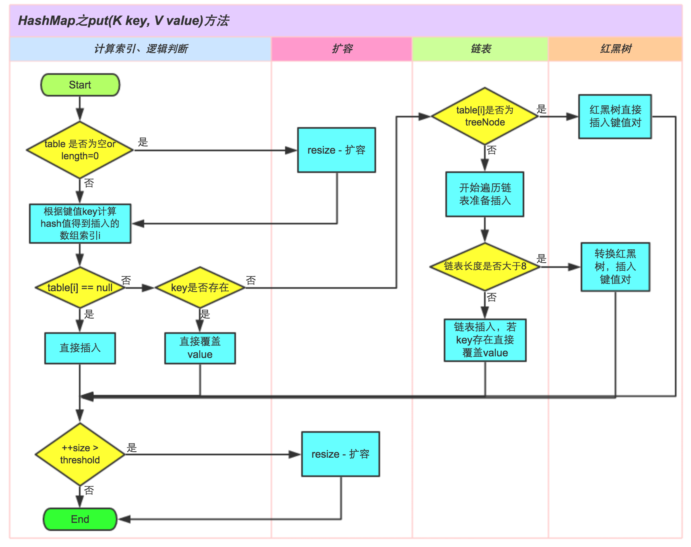

# Hashmap底层实现原理

## put流程

源码,基于1.8(1.8引入红黑树，链表由1.7的头插法改为尾插法)

```
final V putVal(int hash, K key, V value, boolean onlyIfAbsent,
                   boolean evict) {
        Node<K,V>[] tab; Node<K,V> p; int n, i;
        // 判断数组是否为空，长度是否为0，是则进行扩容数组初始化
        if ((tab = table) == null || (n = tab.length) == 0)
            n = (tab = resize()).length;
        // 通过hash算法找到数组下标得到数组元素，为空则新建
        if ((p = tab[i = (n - 1) & hash]) == null)
            tab[i] = newNode(hash, key, value, null);
        else {
            Node<K,V> e; K k;
             // 找到数组元素，hash相等同时key相等，则直接覆盖
            if (p.hash == hash &&
                ((k = p.key) == key || (key != null && key.equals(k))))
                e = p;
            // 该数组元素在链表长度>8后形成红黑树结构的对象
            else if (p instanceof TreeNode)
                e = ((TreeNode<K,V>)p).putTreeVal(this, tab, hash, key, value);
            else {
                // 该数组元素hash相等，key不等，同时链表长度<8.进行遍历寻找元素，有就覆盖无则新建
                for (int binCount = 0; ; ++binCount) {
                    if ((e = p.next) == null) {
                        // 新建链表中数据元素
                        p.next = newNode(hash, key, value, null);
                        if (binCount >= TREEIFY_THRESHOLD - 1) // -1 for 1st
                            // 链表长度>=8 结构转为 红黑树
                            treeifyBin(tab, hash);
                        break;
                    }
                    if (e.hash == hash &&
                        ((k = e.key) == key || (key != null && key.equals(k))))
                        break;
                    p = e;
                }
            }
            if (e != null) { // existing mapping for key
                V oldValue = e.value;
                if (!onlyIfAbsent || oldValue == null)
                    e.value = value;
                afterNodeAccess(e);
                return oldValue;
            }
        }
        ++modCount;
        if (++size > threshold)
            resize();
        afterNodeInsertion(evict);
        return null;
    }
```

下图是一位大神级别画的图，引用一下便于理解



1. 检查数组是否为空，执行resize()扩充；在实例化HashMap时，并不会进行初始化数组）

2. 通过hash值计算数组索引，获取该索引位的首节点。

3. 如果首节点为null（没发生碰撞），则创建新的数组元素，直接添加节点到该索引位(bucket)。

4. 如果首节点不为null（发生碰撞），那么有3种情况

   ① key和首节点的key相同，覆盖old value（保证key的唯一性）；否则执行②或③

   ② 如果首节点是红黑树节点（TreeNode），将键值对添加到红黑树。

   ③ 如果首节点是链表，进行遍历寻找元素，有就覆盖无则新建，将键值对添加到链表。添加之后会判断链表长度是否到达TREEIFY_THRESHOLD - 1这个阈值，“尝试”将链表转换成红黑树。

5. 最后判断当前元素个数是否大于threshold，扩充数组。


## resize() 数组扩容

扩充数组不单单只是让数组长度翻倍，将原数组中的元素直接存入新数组中这么简单。
因为元素的索引是通过hash&(n - 1)得到的，那么数组的长度由n变为2n，重新计算的索引就可能和原来的不一样了。
在jdk1.7中，是通过遍历每一个元素，每一个节点，重新计算他们的索引值，存入新的数组中，称为rehash操作。
而java1.8对此进行了一些优化，没有了rehash操作。因为当数组长度是通过2的次方扩充的，那么会发现以下规律：
元素的位置要么是在原位置，要么是在原位置再移动2次幂的位置。因此，在扩充HashMap的时候，不需要像JDK1.7的实现那样重新计算hash，只需要看看原来的hash值高位新增的那个bit是1还是0就好了，是0的话索引没变，是1的话索引变成“原索引+oldCap”。因为容量扩容2倍相当于二进制高位加一
先计算新数组的长度和新的阈值（threshold），然后将旧数组的内容迁移到新数组中，和1.7相比不需要执行rehash操作。因为以2次幂扩展的数组可以简单通过新增的bit判断索引位。


## 参考

- [https://lushunjian.github.io/blog/2019/01/02/HashMap%E7%9A%84%E5%BA%95%E5%B1%82%E5%AE%9E%E7%8E%B0/](https://lushunjian.github.io/blog/2019/01/02/HashMap的底层实现/)