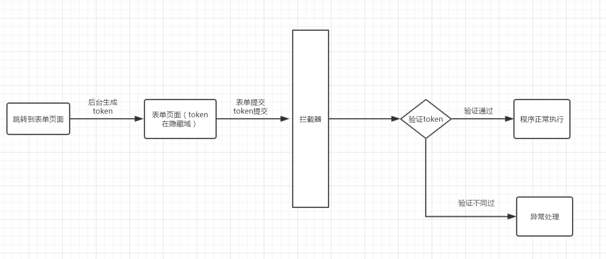

# Redis+token机制实现幂等性操作

## 前言

 使用redis+token实现幂等性操作，防止表单的重复提交和一些其他重复请求操作。有些接口需要保证操作的唯一性，比如：订单接口（重复点击下单，只会生成一个订单号）；支付接口（重复支付也只会扣一次款）；表单接口等等…


## 一、实现幂等性操作的方法

唯一索引 – 防止新增脏数据
token机制 – 防止页面重复提交
悲观锁 – 获取数据的时候加锁(锁表或锁行)
乐观锁 – 基于版本号version实现, 在更新数据那一刻校验数据
分布式锁 – redis(jedis、redisson)或zookeeper实现
状态机 – 状态变更, 更新数据时判断状态

本文使用token机制来实现幂等性操作


### 二、token机制简单流程图与原理（以表单提交为例）




这里以表单提交为例，大致的分析下流程：

1. 在跳转到表单页面时，创建一个Token，存入redis中，并且保存这个token到表单页面中。

2. 现在进入了表单页面，在表单页面添加个隐藏域，放入token。

3. 表单正常提交，token也随之提交。

4. 拦截器开始拦截，获得表单提交的token并与redis中的token进行对比判断。

5. 若判断通过，正常执行程序，并删除token。若判断不通过，说明这次提交的表单有问题，抛出异常，程序不再继续执行

   

【模拟情景：】用户提交了一个表单，但是网络比较慢，用户点了多次提交。此时第一个提交的内容token验证通过了，redis中token被销毁，剩下的请求虽然也携带了token，但是redis中已然没有了数据，剩下的请求验证全部不通过，请求被放弃…


## 三、项目实战

1、跳转页面

 

```java
 	@GetMapping("/diary/newDiary")
    @ApiOperation("跳转到创建随笔页面")
	//这是一个简单的跳转页面controller,在跳转时生成一个token到前段页面去
    public ModelAndView toInsert(Model model){
        String newDiaryToken = redisUtils.getToken();
        model.addAttribute("newDiaryToken",newDiaryToken);
        return new ModelAndView("diary/insert");
    }

```


*2、token生成工具*

```java
/** 
    * @Description: 创建Token，怕麻烦的可以直接生成UUID作为toekn的key和value 
   * @Date: 2020/1/8 0008 
    */ 
    public String getToken(){
        String token_value = UUID.randomUUID().toString().replace("-","");
        int index = new Random().nextInt(5);
        String token_key = token_value.substring(0,index);
        try {
            redisTemplate.opsForValue().set(token_key,token_value);
            return token_key;
        }catch (Exception e){
            e.printStackTrace();
            return null;
        }

    }

```


*3、表单页面加入隐藏项*

```html
<input type="hidden" th:value="${newDiaryToken}" name = "token">
```


*4、拦截器拦截url请求，验证token*

```java
package com.braisedpanda.my.blog.web.framework.filter;

import org.springframework.context.annotation.Bean;
import org.springframework.context.annotation.Configuration;
import org.springframework.web.servlet.config.annotation.*;


/**
 * @program: my-blog
 * @description: token拦截器
 * 
 * @create: 2020-01-08 10:08
 **/
@Configuration
public class TokenInterceptorConfig implements WebMvcConfigurer {

    @Bean
    TokenInterceptor tokenInterceptor(){
        return new TokenInterceptor();
    }

    public void addInterceptors(InterceptorRegistry registry) {
        //拦截指定URL
        registry.addInterceptor(tokenInterceptor())
                .addPathPatterns("/admin/diary/insert/**");
    }

}
```


```java
package com.braisedpanda.my.blog.web.framework.filter;

import com.braisedpanda.my.blog.web.config.redis.RedisUtils;
import lombok.extern.slf4j.Slf4j;
import org.springframework.beans.factory.annotation.Autowired;
import org.springframework.context.annotation.Configuration;
import org.springframework.lang.Nullable;

import org.springframework.util.StringUtils;
import org.springframework.web.servlet.HandlerInterceptor;


import javax.servlet.http.HttpServletRequest;
import javax.servlet.http.HttpServletResponse;

/**
 * @program: my-blog
 * @description:
 
 * @create: 2020-01-08 10:13
 **/
@Configuration
@Slf4j
public class TokenInterceptor implements HandlerInterceptor {
    @Autowired
    private RedisUtils redisUtils;

    @Override
    public boolean preHandle(HttpServletRequest request, HttpServletResponse response, Object handler) throws Exception {
        //验证token
        String token = request.getParameter("token");
        String value = (String)redisUtils.get(token);
        if(!StringUtils.isEmpty(value) && value !=null && value.length()>0){
            redisUtils.del(token);
            log.info("处理请求成功.......");
            return true;
        }else {
            log.error("请勿重复提交表单.......");
            response.sendRedirect("/toError");
            return false;

        }
    }

}
```

