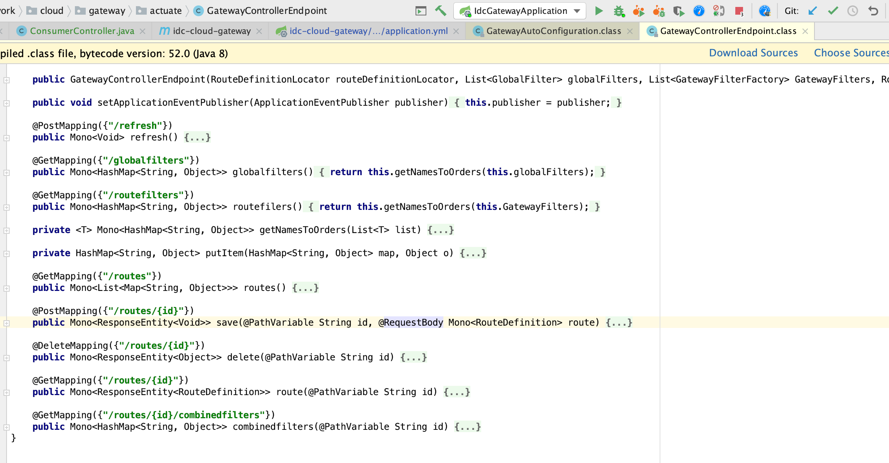

# SpringCloud-Gateway动态路由

接上一篇 [SpringCloud-Gateway静态路由](note/SpringCloud-Gateway静态路由.md)


## 1. 默认动态路由实现

将 actuator 的端点暴露出来。

```yaml
management:
  endpoints:
    web:
      exposure:
        include: "*"
```

然后我们就能通过自带的 `GatewayControllerEndpoint` 的 RESTful API 修改运行时的路由了。




访问: http://localhost:8100/actuator/gateway/routes

输出结果

```json
// 20200220204324
// http://localhost:8100/actuator/gateway/routes

[
  {
    "route_id": "CompositeDiscoveryClient_consul",
    "route_definition": {
      "id": "CompositeDiscoveryClient_consul",
      "predicates": [
        {
          "name": "Path",
          "args": {
            "pattern": "/consul/**"
          }
        }
      ],
      "filters": [
        {
          "name": "RewritePath",
          "args": {
            "regexp": "/consul/(?<remaining>.*)",
            "replacement": "/${remaining}"
          }
        }
      ],
      "uri": "lb://consul",
      "order": 0
    },
    "order": 0
  },
  {
    "route_id": "CompositeDiscoveryClient_idc-cloud-consumer",
    "route_definition": {
      "id": "CompositeDiscoveryClient_idc-cloud-consumer",
      "predicates": [
        {
          "name": "Path",
          "args": {
            "pattern": "/idc-cloud-consumer/**"
          }
        }
      ],
      "filters": [
        {
          "name": "RewritePath",
          "args": {
            "regexp": "/idc-cloud-consumer/(?<remaining>.*)",
            "replacement": "/${remaining}"
          }
        }
      ],
      "uri": "lb://idc-cloud-consumer",
      "order": 0
    },
    "order": 0
  },
  {
    "route_id": "CompositeDiscoveryClient_idc-cloud-gateway",
    "route_definition": {
      "id": "CompositeDiscoveryClient_idc-cloud-gateway",
      "predicates": [
        {
          "name": "Path",
          "args": {
            "pattern": "/idc-cloud-gateway/**"
          }
        }
      ],
      "filters": [
        {
          "name": "RewritePath",
          "args": {
            "regexp": "/idc-cloud-gateway/(?<remaining>.*)",
            "replacement": "/${remaining}"
          }
        }
      ],
      "uri": "lb://idc-cloud-gateway",
      "order": 0
    },
    "order": 0
  },
  {
    "route_id": "CompositeDiscoveryClient_idc-cloud-provider",
    "route_definition": {
      "id": "CompositeDiscoveryClient_idc-cloud-provider",
      "predicates": [
        {
          "name": "Path",
          "args": {
            "pattern": "/idc-cloud-provider/**"
          }
        }
      ],
      "filters": [
        {
          "name": "RewritePath",
          "args": {
            "regexp": "/idc-cloud-provider/(?<remaining>.*)",
            "replacement": "/${remaining}"
          }
        }
      ],
      "uri": "lb://idc-cloud-provider",
      "order": 0
    },
    "order": 0
  },
  {
    "route_id": "provider",
    "route_definition": {
      "id": "provider",
      "predicates": [
        {
          "name": "Path",
          "args": {
            "_genkey_0": "/p/**"
          }
        }
      ],
      "filters": [
        {
          "name": "StripPrefix",
          "args": {
            "_genkey_0": "1"
          }
        }
      ],
      "uri": "lb://idc-cloud-provider",
      "order": 0
    },
    "order": 0
  },
  {
    "route_id": "consumer",
    "route_definition": {
      "id": "consumer",
      "predicates": [
        {
          "name": "Path",
          "args": {
            "_genkey_0": "/c/**"
          }
        }
      ],
      "filters": [
        {
          "name": "StripPrefix",
          "args": {
            "_genkey_0": "1"
          }
        }
      ],
      "uri": "lb://idc-cloud-consumer",
      "order": 0
    },
    "order": 0
  }
]
```


但是 Gateway 自带的这套是仅仅支持了 JVM 级别的动态路由，不能序列化存储的。

默认的实现：

```java
// GatewayAutoConfiguration

(RouteDefinitionRepository.class)
public InMemoryRouteDefinitionRepository inMemoryRouteDefinitionRepository() {
	return new InMemoryRouteDefinitionRepository();
}
```

```java
// InMemoryRouteDefinitionRepository
public class InMemoryRouteDefinitionRepository implements RouteDefinitionRepository {

	private final Map<String, RouteDefinition> routes = synchronizedMap(new LinkedHashMap<String, RouteDefinition>());

	
	public Mono<Void> save(Mono<RouteDefinition> route) {
		return route.flatMap( r -> {
			routes.put(r.getId(), r);
			return Mono.empty();
		});
	}

	
	public Mono<Void> delete(Mono<String> routeId) {
		return routeId.flatMap(id -> {
			if (routes.containsKey(id)) {
				routes.remove(id);
				return Mono.empty();
			}
			return Mono.defer(() -> Mono.error(new NotFoundException("RouteDefinition not found: "+routeId)));
		});
	}

	
	public Flux<RouteDefinition> getRouteDefinitions() {
		return Flux.fromIterable(routes.values());
	}
}
```

这样就导致我们的路由配置要分散存储在两个地方：Config Server 和 内存中，非常不利于管理。
另外在生产环境使用的话，Gateway 一定是一个集群，一个个去调用每个实例的 refresh 端口并不利于扩展。


## 2. 基于Redis实现动态路由

pom.xml增加依赖

```xml
        <dependency>
            <groupId>org.springframework.boot</groupId>
            <artifactId>spring-boot-starter-data-redis</artifactId>
        </dependency>
        <dependency>
            <groupId>com.alibaba</groupId>
            <artifactId>fastjson</artifactId>
            <version>1.2.51</version>
        </dependency>
```

redis配置

```java
@Configuration
public class RedisConfig {

    @Bean(name = {"redisTemplate", "stringRedisTemplate"})
    public StringRedisTemplate stringRedisTemplate(RedisConnectionFactory factory) {
        StringRedisTemplate redisTemplate = new StringRedisTemplate();
        redisTemplate.setConnectionFactory(factory);
        return redisTemplate;
    }

}
```

RedisRouteDefinitionRepository.java

```java
@Component
public class RedisRouteDefinitionRepository implements RouteDefinitionRepository {

    /**
     * hash存储的key
     */
    public static final String GATEWAY_ROUTES = "gateway_dynamic_route";

    @Resource
    private StringRedisTemplate redisTemplate;

    /**
     * 获取路由信息
     * @return
     */
    @Override
    public Flux<RouteDefinition> getRouteDefinitions() {
        List<RouteDefinition> routeDefinitions = new ArrayList<>();
        redisTemplate.opsForHash().values(GATEWAY_ROUTES).stream()
                .forEach(routeDefinition -> routeDefinitions.add(JSON.parseObject(routeDefinition.toString(), RouteDefinition.class)));
        return Flux.fromIterable(routeDefinitions);
    }

    @Override
    public Mono<Void> save(Mono<RouteDefinition> route) {
        return route.flatMap(routeDefinition -> {
            redisTemplate.opsForHash().put(GATEWAY_ROUTES, routeDefinition.getId(), JSONObject.toJSONString(routeDefinition));
            return Mono.empty();
        });
    }

    @Override
    public Mono<Void> delete(Mono<String> routeId) {
        return routeId.flatMap(id -> {
            if (redisTemplate.opsForHash().hasKey(GATEWAY_ROUTES, id)) {
                redisTemplate.opsForHash().delete(GATEWAY_ROUTES, id);
                return Mono.empty();
            }
            return Mono.defer(() -> Mono.error(new NotFoundException("route definition is not found, routeId:" + routeId)));
        });
    }

}
```

GatewayDynamicRouteService.java

```java
@Service
public class GatewayDynamicRouteService implements ApplicationEventPublisherAware {

    @Resource
    private RedisRouteDefinitionRepository redisRouteDefinitionRepository;

    private ApplicationEventPublisher applicationEventPublisher;

    /**
     * 增加路由
     * @param routeDefinition
     * @return
     */
    public int add(RouteDefinition routeDefinition) {
        redisRouteDefinitionRepository.save(Mono.just(routeDefinition)).subscribe();
        applicationEventPublisher.publishEvent(new RefreshRoutesEvent(this));
        return 1;
    }

    /**
     * 更新
     * @param routeDefinition
     * @return
     */
    public int update(RouteDefinition routeDefinition) {
        redisRouteDefinitionRepository.delete(Mono.just(routeDefinition.getId()));
        redisRouteDefinitionRepository.save(Mono.just(routeDefinition)).subscribe();
        applicationEventPublisher.publishEvent(new RefreshRoutesEvent(this));
        return 1;
    }

    /**
     * 删除
     * @param id
     * @return
     */
    public Mono<ResponseEntity<Object>> delete(String id) {
        return redisRouteDefinitionRepository.delete(Mono.just(id)).then(Mono.defer(() -> Mono.just(ResponseEntity.ok().build())))
                .onErrorResume(t -> t instanceof NotFoundException, t -> Mono.just(ResponseEntity.notFound().build()));
    }


    @Override
    public void setApplicationEventPublisher(ApplicationEventPublisher applicationEventPublisher) {
        this.applicationEventPublisher = applicationEventPublisher;
    }
}
```

GatewayDynamicRouteController.java

```java
@RestController
@RequestMapping("/gateway")
public class GatewayDynamicRouteController {

    @Resource
    private GatewayDynamicRouteService gatewayDynamicRouteService;

    @PostMapping("/add")
    public String create(@RequestBody RouteDefinition entity) {
        int result = gatewayDynamicRouteService.add(entity);
        return String.valueOf(result);
    }

    @PostMapping("/update")
    public String update(@RequestBody RouteDefinition entity) {
        int result = gatewayDynamicRouteService.update(entity);
        return String.valueOf(result);
    }

    @DeleteMapping("/delete/{id}")
    public Mono<ResponseEntity<Object>> delete(@PathVariable String id) {
        return gatewayDynamicRouteService.delete(id);
    }

}
```

请求add方法模拟添加路由[POST] http://localhost:8100/gateway/add

```json
{
    "id": "test",
    "predicates": [
        {
            "name": "Path",
            "args": {
                "_genkey_0": "/t/**"
            }
        }
    ],
    "filters": [
        {
            "name": "StripPrefix",
            "args": {
                "_genkey_0": "1"
            }
        }
    ],
    "uri": "lb://idc-cloud-consumer",
    "order": 0
}
```

这时我们再访问 http://localhost:8100/actuator/gateway/routes

```json
[
    {
        "route_id": "test",
        "route_definition": {
            "id": "test",
            "predicates": [
                {
                    "name": "Path",
                    "args": {
                        "_genkey_0": "/t/**"
                    }
                }
            ],
            "filters": [
                {
                    "name": "StripPrefix",
                    "args": {
                        "_genkey_0": "1"
                    }
                }
            ],
            "uri": "lb://idc-cloud-consumer",
            "order": 0
        },
        "order": 0
    },
    {
        "route_id": "CompositeDiscoveryClient_consul",
        "route_definition": {
            "id": "CompositeDiscoveryClient_consul",
            "predicates": [
                {
                    "name": "Path",
                    "args": {
                        "pattern": "/consul/**"
                    }
                }
            ],
            "filters": [
                {
                    "name": "RewritePath",
                    "args": {
                        "regexp": "/consul/(?<remaining>.*)",
                        "replacement": "/${remaining}"
                    }
                }
            ],
            "uri": "lb://consul",
            "order": 0
        },
        "order": 0
    },
    {
        "route_id": "CompositeDiscoveryClient_idc-cloud-consumer",
        "route_definition": {
            "id": "CompositeDiscoveryClient_idc-cloud-consumer",
            "predicates": [
                {
                    "name": "Path",
                    "args": {
                        "pattern": "/idc-cloud-consumer/**"
                    }
                }
            ],
            "filters": [
                {
                    "name": "RewritePath",
                    "args": {
                        "regexp": "/idc-cloud-consumer/(?<remaining>.*)",
                        "replacement": "/${remaining}"
                    }
                }
            ],
            "uri": "lb://idc-cloud-consumer",
            "order": 0
        },
        "order": 0
    },
    {
        "route_id": "CompositeDiscoveryClient_idc-cloud-gateway",
        "route_definition": {
            "id": "CompositeDiscoveryClient_idc-cloud-gateway",
            "predicates": [
                {
                    "name": "Path",
                    "args": {
                        "pattern": "/idc-cloud-gateway/**"
                    }
                }
            ],
            "filters": [
                {
                    "name": "RewritePath",
                    "args": {
                        "regexp": "/idc-cloud-gateway/(?<remaining>.*)",
                        "replacement": "/${remaining}"
                    }
                }
            ],
            "uri": "lb://idc-cloud-gateway",
            "order": 0
        },
        "order": 0
    },
    {
        "route_id": "CompositeDiscoveryClient_idc-cloud-provider",
        "route_definition": {
            "id": "CompositeDiscoveryClient_idc-cloud-provider",
            "predicates": [
                {
                    "name": "Path",
                    "args": {
                        "pattern": "/idc-cloud-provider/**"
                    }
                }
            ],
            "filters": [
                {
                    "name": "RewritePath",
                    "args": {
                        "regexp": "/idc-cloud-provider/(?<remaining>.*)",
                        "replacement": "/${remaining}"
                    }
                }
            ],
            "uri": "lb://idc-cloud-provider",
            "order": 0
        },
        "order": 0
    },
    {
        "route_id": "provider",
        "route_definition": {
            "id": "provider",
            "predicates": [
                {
                    "name": "Path",
                    "args": {
                        "_genkey_0": "/p/**"
                    }
                }
            ],
            "filters": [
                {
                    "name": "StripPrefix",
                    "args": {
                        "_genkey_0": "1"
                    }
                }
            ],
            "uri": "lb://idc-cloud-provider",
            "order": 0
        },
        "order": 0
    },
    {
        "route_id": "consumer",
        "route_definition": {
            "id": "consumer",
            "predicates": [
                {
                    "name": "Path",
                    "args": {
                        "_genkey_0": "/c/**"
                    }
                }
            ],
            "filters": [
                {
                    "name": "StripPrefix",
                    "args": {
                        "_genkey_0": "1"
                    }
                }
            ],
            "uri": "lb://idc-cloud-consumer",
            "order": 0
        },
        "order": 0
    }
]
```

可以看到新添加的路由已经成功了，测试下路由是否生效

访问 http://localhost:8100/t/consumer

结果

```
Services: [consul, idc-cloud-consumer, idc-cloud-gateway, idc-cloud-provider]
```

可见动态路由已生效