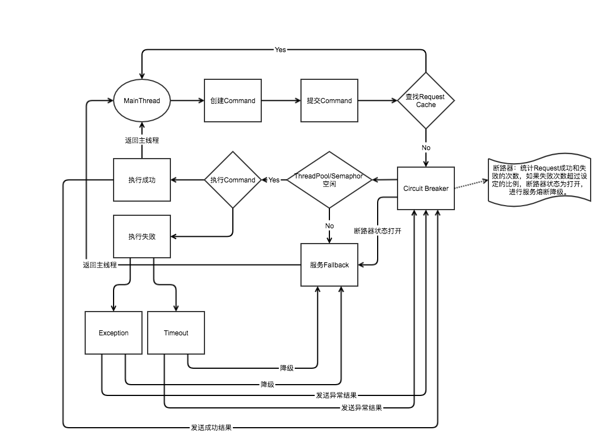

# Spring之Hystrix





## 1. 触发fallback条件(降级)

Hystrix会在以下四种情况下触发fallback函数：

1.任务超过了"withExecutionTimeoutInMilliseconds"定义的超时时间；

2.任务抛出了非HystrixBadRequestException的异常；

3.线程池/信号量已满；

4.熔断器打开；


## 2. 熔断


## 3. 降级

依赖

```xml
        <dependency>
            <groupId>com.netflix.hystrix</groupId>
            <artifactId>hystrix-core</artifactId>
            <version>1.5.18</version>
        </dependency>
        <dependency>
            <groupId>com.netflix.hystrix</groupId>
            <artifactId>hystrix-metrics-event-stream</artifactId>
            <version>1.5.18</version>
        </dependency>
        <dependency>
            <groupId>com.netflix.hystrix</groupId>
            <artifactId>hystrix-javanica</artifactId>
            <version>1.5.18</version>
        </dependency>
```

配置

```java
@Configuration
public class HystrixConfig {

    /**
     * 用来拦截处理HystrixCommand注解
     * @return
     */
    @Bean
    public HystrixCommandAspect hystrixCommandAspect() {
        return new HystrixCommandAspect();
    }

    /**
     * 用来向监控中心Dashboard发送stream信息
     * @return
     */
    @Bean
    public ServletRegistrationBean hystrixMetricsStreamServlet() {
        ServletRegistrationBean registration = new ServletRegistrationBean(new HystrixMetricsStreamServlet());
        registration.addUrlMappings("/hystrix.stream");
        return registration;
    }
}
```


**超时降级**

```java
@Slf4j
@Service
public class OrderService1 {

    /**
     * 超时降级策略
     * @param order
     * @return
     */
    @HystrixCommand(commandKey = "/orders/create",
            commandProperties = {
                    @HystrixProperty(name="execution.timeout.enabled",value="true"),
                    @HystrixProperty(name="execution.isolation.thread.timeoutInMilliseconds",value="3000")
            },
            fallbackMethod = "createOrderFallbackMethodTimeout")
    public String createOrder(@RequestBody String order){

        try {
            Thread.sleep(5000);
        } catch (InterruptedException e) {
//            e.printStackTrace();
        }
        return "success";
    }

    /**
     * 超时降级策略 createOrder超时降级
     * @param order
     * @return
     */
    public String createOrderFallbackMethodTimeout(String order){
        log.info("--------超时降级策略执行--------");
        return "Hystrix time out";
    }
}

```

测试

```java
    @Test
    void timeoutDowngrade() throws InterruptedException {

        // 测试Hystrix超时降级策略
        CountDownLatch countDownLatch1 = new CountDownLatch(10);
        ExecutorService exec1 = Executors.newCachedThreadPool();

        for (int i=0; i<10; i++) {
            exec1.execute(() -> {
                try {
                    orderService1.createOrder("orderService1");
                } finally {
                    countDownLatch1.countDown();
                }
            });
        }
        countDownLatch1.await();
        exec1.shutdown();

    }
```

结果

```log
2020-02-13 23:48:09.440  INFO 48096 --- [ HystrixTimer-1] com.idcmind.ants.hystrix.OrderService1   : --------超时降级策略执行--------
2020-02-14 00:39:08.165  INFO 48542 --- [ HystrixTimer-4] com.idcmind.ants.hystrix.OrderService1   : --------超时降级策略执行--------
2020-02-14 00:39:08.165  INFO 48542 --- [ HystrixTimer-5] com.idcmind.ants.hystrix.OrderService1   : --------超时降级策略执行--------
2020-02-14 00:39:08.165  INFO 48542 --- [ HystrixTimer-3] com.idcmind.ants.hystrix.OrderService1   : --------超时降级策略执行--------
2020-02-14 00:39:08.165  INFO 48542 --- [ HystrixTimer-1] com.idcmind.ants.hystrix.OrderService1   : --------超时降级策略执行--------
2020-02-14 00:39:08.165  INFO 48542 --- [ HystrixTimer-6] com.idcmind.ants.hystrix.OrderService1   : --------超时降级策略执行--------
2020-02-14 00:39:08.165  INFO 48542 --- [ HystrixTimer-2] com.idcmind.ants.hystrix.OrderService1   : --------超时降级策略执行--------
2020-02-14 00:39:08.165  INFO 48542 --- [ HystrixTimer-8] com.idcmind.ants.hystrix.OrderService1   : --------超时降级策略执行--------
2020-02-14 00:39:08.165  INFO 48542 --- [ HystrixTimer-7] com.idcmind.ants.hystrix.OrderService1   : --------超时降级策略执行--------
2020-02-14 00:39:08.172  INFO 48542 --- [ HystrixTimer-4] com.idcmind.ants.hystrix.OrderService1   : --------超时降级策略执行--------
2020-02-14 00:39:08.172  INFO 48542 --- [ HystrixTimer-6] com.idcmind.ants.hystrix.OrderService1   : --------超时降级策略执行--------

```


## 4. 限流

配置

```java
@Configuration
public class HystrixConfig {

    /**
     * 用来拦截处理HystrixCommand注解
     * @return
     */
    @Bean
    public HystrixCommandAspect hystrixCommandAspect() {
        return new HystrixCommandAspect();
    }

    /**
     * 用来向监控中心Dashboard发送stream信息
     * @return
     */
    @Bean
    public ServletRegistrationBean hystrixMetricsStreamServlet() {
        ServletRegistrationBean registration = new ServletRegistrationBean(new HystrixMetricsStreamServlet());
        registration.addUrlMappings("/hystrix.stream");
        return registration;
    }
}
```


**信号量限流**

```java
@Slf4j
@Service
public class OrderService2 {

    /**
     * 限流策略：信号量方式
     * @param order
     * @return
     */
    @HystrixCommand(commandKey = "/orders/insert",
            commandProperties = {
                    @HystrixProperty(name="execution.isolation.strategy",value="SEMAPHORE"),
                    @HystrixProperty(name="execution.isolation.semaphore.maxConcurrentRequests",value="3"),
            },
            fallbackMethod = "insertOrderFallbackMethodSemaphore")
    public String insertOrder(@RequestBody String order){

        return "success";
    }

    /**
     * 限流策略：信号量方式 insertOrder限流降级
     * @param order
     * @return
     */
    public String insertOrderFallbackMethodSemaphore( String order){
        log.info("--------信号量限流降级策略执行--------");
        return "Hystrix semaphore";
    }
}
```

测试

```java
    @Test
    public void rateLimit1() throws InterruptedException {
        // 测试Hystrix信号量降级策略
        CountDownLatch countDownLatch = new CountDownLatch(5);
        ExecutorService exec = Executors.newCachedThreadPool();

        for (int i=0; i<5; i++) {
            exec.execute(() -> {
                try {
                    orderService2.insertOrder("orderService2");
                } finally {
                    countDownLatch.countDown();
                }
            });
        }
        countDownLatch.await();
        exec.shutdown();


    }
```

结果

```
2020-02-13 23:52:14.122  INFO 48135 --- [pool-3-thread-2] com.idcmind.ants.hystrix.OrderService2   : --------信号量限流降级策略执行--------
2020-02-13 23:52:14.122  INFO 48135 --- [pool-3-thread-1] com.idcmind.ants.hystrix.OrderService2   : --------信号量限流降级策略执行--------

```


**线程池限流(默认策略)**

```java
@Slf4j
@Service
public class OrderService3 {

    /**
     * 限流策略：线程池方式
     * @param order
     * queueSizeRejectionThreshold 排队线程数量阈值，默认为5，达到时拒绝
     * @return
     */
    @HystrixCommand(commandKey = "/orders/add",
            commandProperties = {
                    @HystrixProperty(name="execution.isolation.strategy",value="THREAD")
            },
            threadPoolKey = "addOrderThreadPool",
            threadPoolProperties = {
                    @HystrixProperty(name="coreSize",value="3"),
                    @HystrixProperty(name="maxQueueSize",value="5"),
                    @HystrixProperty(name="queueSizeRejectionThreshold",value="5")
            },
            fallbackMethod = "addOrderFallbackMethodThread")
    public String addOrder(@RequestBody String order){

        return "success";
    }

    /**
     *  限流策略：线程池方式 addOrder限流降级
     * @param order
     * @return
     */
    public String addOrderFallbackMethodThread(String order){
        log.info("--------线程池限流降级策略执行--------");
        return "Hystrix threadPool";
    }
}
```

测试

```java
    @Test
    public void rateLimit2() throws InterruptedException {
        // 测试Hystrix线程池降级策略
        CountDownLatch countDownLatch1 = new CountDownLatch(10);
        ExecutorService exec1 = Executors.newCachedThreadPool();

        for (int i=0; i<10; i++) {
            exec1.execute(() -> {
                try {
                    orderService3.addOrder("orderService3");
                } finally {
                    countDownLatch1.countDown();
                }
            });
        }
        countDownLatch1.await();
        exec1.shutdown();
    }

```

输出

```
2020-02-13 23:54:26.876  INFO 48146 --- [pool-3-thread-9] com.idcmind.ants.hystrix.OrderService3   : --------线程池限流降级策略执行--------
2020-02-13 23:54:26.878  INFO 48146 --- [ool-3-thread-10] com.idcmind.ants.hystrix.OrderService3   : --------线程池限流降级策略执行--------

```

