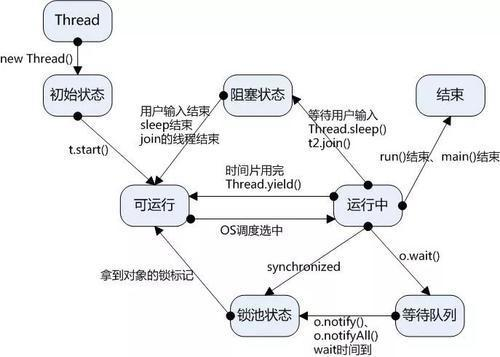

# 多线程通信案例


## 1. 线程状态




## 2. 多线程顺序打印ABC

### 方案1：通过ReentrantLock和Condition实现

```java
/**
 * 多线程顺序打印ABC
 * lock()方法：    如果被其它线程占用锁，会阻塞在此等待锁释放
 * await()方法：   会阻塞线程，并让该Condition关联的锁释放(阻塞在lock方法处的线程重新获取锁)
 * signal()方法:   唤醒该Condition关联的线程
 *
 * 打印结果: ABC
 */
public class ABC1 {
    private int status =1;
    private ReentrantLock lock = new ReentrantLock();
    private Condition conditionA = lock.newCondition();
    private Condition conditionB = lock.newCondition();
    private Condition conditionC = lock.newCondition();

    public void printA(){
        lock.lock();
        try{
            if(status!=1){
                conditionA.await();
            }
            System.out.print("A");
            status=2;
            conditionB.signal();
        }catch(InterruptedException e){
            e.printStackTrace();
        }finally{
            lock.unlock();
        }
    }
    public void printB(){
        lock.lock();
        try{
            if(status!=2){
                conditionB.await();
            }
            System.out.print("B");
            status=3;
            conditionC.signal();
        }catch(InterruptedException e){
            e.printStackTrace();
        }finally{
            lock.unlock();
        }
    }
    public void printC(){
        lock.lock();
        try{
            if(status!=3){
                conditionC.await();
            }
            System.out.println("C");
            status=1;
            conditionA.signal();
        }catch(InterruptedException e){
            e.printStackTrace();
        }finally{
            lock.unlock();
        }
    }

    public static void main(String[] args) {

        ABC1 print = new ABC1();
        Thread threadA = new Thread(new Runnable() {
            @Override
            public void run() {
                print.printA();
            }
        });
        Thread threadB = new Thread(new Runnable() {
            @Override
            public void run() {
                print.printB();
            }
        });
        Thread threadC = new Thread(new Runnable() {
            @Override
            public void run() {
                print.printC();
            }
        });
        threadA.start();
        threadB.start();
        threadC.start();
    }
}
```


### 方案二: 通过semaphore信号量实现

```java
public class ABC2 {

    // A初始信号量数量为1
    private Semaphore A = new Semaphore(1);
    // B、C初始信号数量为0
    private Semaphore B = new Semaphore(0);
    private Semaphore C = new Semaphore(0);

    public void printA() {
        try {
            // A获取信号执行,A信号量减1,当A为0时将无法继续获得该信号量
            A.acquire();
            System.out.println("A");
            //B释放之后信号量加1(初始为0),查看源码可知
            B.release();
        } catch (InterruptedException e) {
            e.printStackTrace();
        }
    }

    public void printB() {
        try {
            B.acquire();
            System.out.println("B");
            C.release();

        } catch (InterruptedException e) {
            e.printStackTrace();
        }
    }

    public void printC() {
        try {
            C.acquire();
            System.out.println("C");

        } catch (InterruptedException e) {
            e.printStackTrace();
        }
    }

    public static void main(String[] args) {

        ABC2 abc2 = new ABC2();
        Thread threadA = new Thread(() -> {
            abc2.printA();
        });
        Thread threadB = new Thread(() -> {
            abc2.printB();
        });
        Thread threadC = new Thread(() -> {
            abc2.printC();
        });

        threadA.start();
        threadB.start();
        threadC.start();
    }

}
```

### 方案三：通过wait()和notify()实现

```java
public class ABC3 {

    final Object lock = new Object();
    String id = "A";

    public void printA() {
        synchronized (lock) {
            while (!"A".equals(id)) {
                try {
                    lock.wait();
                } catch (InterruptedException e) {
                    e.printStackTrace();
                }
            }

            System.out.println("A");
            id = "B";
            lock.notifyAll();
        }
    }

    public void printB() {
        synchronized (lock) {
            while (!"B".equals(id)) {
                try {
                    lock.wait();
                } catch (InterruptedException e) {
                    e.printStackTrace();
                }
            }

            System.out.println("B");
            id = "C";
            lock.notifyAll();
        }
    }

    public void printC() {
        synchronized (lock) {
            while (!"C".equals(id)) {
                try {
                    lock.wait();
                } catch (InterruptedException e) {
                    e.printStackTrace();
                }
            }

            System.out.println("C");
            lock.notifyAll();
        }
    }

    public static void main(String[] args) {
        ABC3 abc3 = new ABC3();
        new Thread(new Runnable() {
            @Override
            public void run() {
                abc3.printA();
            }
        }).start();

        new Thread(new Runnable() {
            @Override
            public void run() {
                abc3.printB();
            }
        }).start();

        new Thread(new Runnable() {
            @Override
            public void run() {
                abc3.printC();
            }
        }).start();
    }
}

```


## 3. 线程交叉打印数据

题目: 

A线程生产A数据，然后打印B；B线程生产B数据，打印A数据。

```java
/**
 * ThreadA--生产A--打印B--start
 * ThreadB--生产B--打印A--start
 */
public class ThreadLockDemo {

    private String A = null;
    private String B = null;

    private ReentrantLock lock = new ReentrantLock();
    private Condition conditionA = lock.newCondition();
    private Condition conditionB = lock.newCondition();

    public void doA() {
        lock.lock();
        try {
            // 生产A
            A = "A";
            if (B == null) {
                conditionA.await();
            }
            // 打印B
            System.out.println(B);

            // 唤醒B线程
            conditionB.signal();
        } catch (Exception e) {
            e.printStackTrace();
        } finally {
            lock.unlock();
        }
    }

    public void doB() {
        lock.lock();
        try {
            // 生产B
            B = "B";
            if (A == null) {
                conditionB.await();
            }
            // 打印A
            System.out.println(A);

            // 唤醒A线程
            conditionA.signal();
        } catch (Exception e) {
            e.printStackTrace();
        } finally {
            lock.unlock();
        }
    }


    public static void main(String[] args) {
        ThreadLockDemo threadLockDemo = new ThreadLockDemo();
        new Thread(new Runnable() {
            @Override
            public void run() {
                threadLockDemo.doA();
            }
        }).start();

        new Thread(new Runnable() {
            @Override
            public void run() {
                threadLockDemo.doB();
            }
        }).start();
    }
}
```

