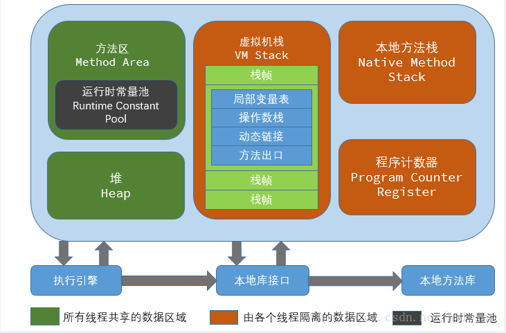
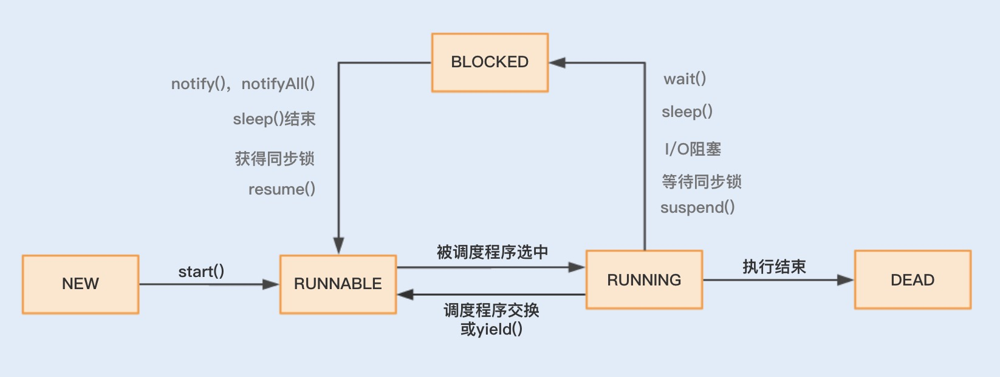

# 前言

以下是阅读《深入理解java虚拟机》一书的笔记，仅供参考

JVM = 类加载器 classloader + 执行引擎 execution engine + 运行时数据区域 runtime data area
classloader 把硬盘上的class 文件加载到JVM中的运行时数据区域, 但是它不负责这个类文件能否执行，而这个是 执行引擎 负责的。

**上下文切换**

CPU通过时间片分配算法来循环执行任务，当前任务执行一个时间片后会切换到下一个任务。
但是，在切换前会保存上一个任务的状态，以便下次切换回这个任务时，可以再次加载这个任务的状态，从任务保存到再加载的过程就是一次上下文切换。

# 笔记

## 运行时数据区



### 1. 程序计数器

当前线程所执行的字节码的行号指示器，字节码解析器的工作是通过改变这个计数器的值，来选取下一条需要执行的字节码指令，分支、循环、跳转、异常处理、线程恢复等基础功能，都需要依赖这个计数器来完成；

### 2. 虚拟机栈

用于存储局部变量表、操作数栈、动态链接、方法出口等信息；

### 3. 本地方法栈

与虚拟机栈的作用是一样的，只不过虚拟机栈是服务 Java 方法的，而本地方法栈是为虚拟机调用 Native 方法服务的；

### 4. 堆

Java 虚拟机中内存最大的一块，是被所有线程共享的，几乎所有的对象实例都在这里分配内存；

### 5. 方法区

用于存储已被虚拟机加载的类信息、常量、静态变量、即时编译后的代码等数据。

### 6. 运行时常量池

## 常用JVM参数

```jvm
-Xms2g：初始化推大小为 2g；
-Xmx2g：堆最大内存为 2g；
-XX:NewRatio=4：设置年轻的和老年代的内存比例为 1:4；
-XX:SurvivorRatio=8：设置新生代 Eden 和 Survivor 比例为 8:2；
–XX:+UseParNewGC：指定使用 ParNew + Serial Old 垃圾回收器组合；
-XX:+UseParallelOldGC：指定使用 ParNew + ParNew Old 垃圾回收器组合；
-XX:+UseConcMarkSweepGC：指定使用 CMS + Serial Old 垃圾回收器组合；
-XX:+PrintGC：开启打印 gc 信息；
-XX:+PrintGCDetails：打印 gc 详细信息。
-XX:+HeapDumpOnOutOfMemoryError：  虚拟机在出现内存溢出异常时dump出当前内存堆转储快照以便事后进行分析
```
### 一般分析过程

一般先通过内存映象分析工具对Dump出来的堆转储快照进行分析，重点是确认内存中的对象是否是必要的，也就是要分清楚到底是出现了内存泄露还是内存溢出

## 垃圾收集器与内存回收策略

### 如何判断对象是否可以被回收？

1. **引用计数器**：为每个对象创建一个引用计数，有对象引用时计数器 +1，引用被释放时计数 -1，当计数器为 0 时就可以被回收。它有一个缺点不能解决循环引用的问题；
2. **可达性分析**：从 GC Roots 开始向下搜索，搜索所走过的路径称为引用链。当一个对象到 GC Roots 没有任何引用链相连时，则证明此对象是可以被回收的。

在Java语言中，可作为GC Roots的对象包含以下几种：

- 虚拟机栈(栈帧中的本地变量表)中引用的对象。(可以理解为:引用栈帧中的本地变量表的所有对象)
- 方法区中静态属性引用的对象(可以理解为:引用方法区该静态属性的所有对象)
- 方法区中常量引用的对象(可以理解为:引用方法区中常量的所有对象)
- 本地方法栈中(Native方法)引用的对象(可以理解为:引用Native方法的所有对象)

### 垃圾回收算法

1. 标记清除
2. 复制
3. 标记整理
4. 分代收集

### jdk命令行工具

```jdk
jps: 显示系统内所有hotspot虚拟机进程
jstat: 用于收集Hotspot虚拟机各方面的运行参数。
jinfo: 显示虚拟机配置信息
jmap: 生成虚拟机内存转储快照
jhat: 用于分析heapdump文件，它会建立一个http/html服务器，让用户可以在浏览器上查看分析结果
jstack: 显示虚拟机的线程快照
```
**jstat:**

它可以显示本地或者远程虚拟机进程中类装载、内存、**垃圾收集(gc)**、JIT编译等运行数据，它是运行期定位虚拟机性能问题的首选工具

|选项|作用|
| --- | --- |
|-class|监视类装载、卸载数量、总空间以及类装载所耗费的时间|
|-gc|监视java堆状况，包括Eden区，2个servivor区、老年代、永久代等的容量、已用空间、GC时间合计等信息|
|-gccapacity|监视内容与-gc基本相同，但输出主要关注java堆各个区域使用到的最大、最小空间|
|-gcutil|监视内容与-gc基本相同，但输出主要关注已使用空间占总空间的百分比|
|-gccause|与-gcutil功能一样，但是会额外输出导致上一次gc产生的原因|
|-gcnew|监视新生代GC状况|
|-gcnewcapacity|监视内容与-gcnew基本相同，输出主要关注使用到的最大最小空间|
|-gcold|监视GC老年代状况|
|-gcoldcapacity|监视内容与-gcold基本相同，输出主要关注使用到的最大最小空间|
|-gcpermcapacity|输出永久代使用到的最大、最小空间|
|-compiler|输出JIT编译器编译过的方法、耗时等信息|
|-printcompilation|输出已经被JIT编译的方法|

**jmap**

|选项|作用|
| --- | --- |
|-dump|生成java堆转储快照。格式为:-dump:[live, ]format=b, file=<filename>,其中live子参数说明是否只dump出存活的对象|
|-finalizerinfo|显示在finalizer线程执行finalize方法的对象，只在linux平台下有效|
|-heap|显示java堆详细信息，如使用哪些回收器、参数配置、分代状况等。只在linux平台下有效|
|-histo|显示堆中对象统计信息，包括类、实例数量、合计容量|
|-permstat|以Classloader为统计口径显示永久代内存状态。只在linux平台下有效|
|-F|当虚拟机进程对-dump选项没有响应时，可使用这个选项强制生成dump快照，只在linux平台下有效|

**jstack**

生成线程快照的主要目的是定位线程出现长时间停顿的原因，如**线程死锁、死循环、请求外部资源导致的长时间等待**等都是导致线程长时间停顿的原因

### jdk可视化工具

**jconsole**

用于对 JVM 中的内存、线程和类等进行监控；

**jvisualvm**

JDK 自带的全能分析工具，可以分析：内存快照、线程快照、程序死锁、监控内存的变化、gc 变化等。

## 类加载过程

类装载分为以下 5 个步骤：

- 加载：根据查找路径找到相应的 class 文件然后导入；
- 检查：检查加载的 class 文件的正确性；
- 准备：给类中的静态变量分配内存空间；
- 解析：虚拟机将常量池中的符号引用替换成直接引用的过程。符号引用就理解为一个标示，而在直接引用直接指向内存中的地址；
- 初始化：对静态变量和静态代码块执行初始化工作。

首先通过类加载器（ClassLoader）会把 Java 代码转换成字节码，
运行时数据区（Runtime Data Area）再把字节码加载到内存中，
而字节码文件只是 JVM 的一套指令集规范，并不能直接交个底层操作系统去执行，
因此需要特定的命令解析器执行引擎（Execution Engine），将字节码翻译成底层系统指令，再交由 CPU 去执行，
而这个过程中需要调用其他语言的本地库接口（Native Interface）来实现整个程序的功能。

**加载**

1. 通过类的全限定名来获取定义此类的二进制字节流
2. 将这个字节流代表的静态存储结构转化为方法区的运行时数据结构
3. 在内存中生成一个代表这个类的java.lang.Class对象，作为方法区这个类的各种数据的访问入口

加载完成后，虚拟机外部的二进制字节流就按照虚拟机所需的格式存储在方法区之中

**验证**

1. 文件格式的验证
2. 元数据验证
3. 字节码验证
4. 符号引用验证

**准备**

准备阶段是正式为类变量分配内存并设置类变量初始值的阶段，这些变量所使用的内存都将在方法区中进行分配。
首先，这时候进行内存分配的仅包括类变量(被static修饰的变量)， 而不包括实例变量，
实例变量将会在对象实例化时随着对象一起分配在java堆中。
其次，这里所说的初始值通常情况下是数据类型的零值

**解析**

解析阶段是虚拟机将常量池内的符号引用替换成直接引用的过程。

1. 类解析
2. 字段解析
3. 类方法解析
4. 接口方法解析

**初始化**

执行类中定义的java程序代码

## 类加载器

- 启动类加载器
- 扩展类加载器
- 应用程序类加载器


**双亲委派模型**的实现

```java
protected synchronized Class<?> loadClass(String name,boolean resolve)throws ClassNotFoundException{
    //首先，检查请求的类是否已经被加载过了
    Class c = findLoadedClass(name);
    if(c == null){
        try{
            if(parent != null){
                c = parent.loadClass(name,false);
            }else{
                c = findBootstrapClassOrNull(name);
            }
        }catch(ClassNotFoundException e){
            //如果父类加载器抛出ClassNotFoundException，说明父类加载器无法完成加载请求
        }
        if(c == null){
            // 在父类加载器无法加载的情况下，再调用本身的findClass方法来进行类加载
            c = findClass(name);
        }
    }
    if(resolve){
        resolveClass(c);
    }
    return c;
}
```

# 线程上下文

## 切换诱因

1. 在操作系统中，上下文切换的类型可以分为进程间的上下文切换和线程间的上下文切换

2. 线程状态：NEW、RUNNABLE、RUNNING、BLOCKED、DEAD
 Java线程状态：NEW、RUNNABLE、BLOCKED、WAITING、TIMED_WAITING、TERMINATED

3. 线程上下文切换：RUNNING -> BLOCKED -> RUNNABLE -> 被调度器选中执行

一个线程从RUNNING状态转为BLOCKED状态，称为一个线程的暂停
线程暂停被切出后，操作系统会**保存相应的上下文**

以便该线程再次进入RUNNABLE状态时能够在之前执行进度的基础上继续执行
一个线程从BLOCKED状态进入RUNNABLE状态，称为一个线程的唤醒
此时线程将获取上次保存的上下文继续执行

4. 诱因：程序本身触发的自发性上下文切换、系统或虚拟机触发的非自发性上下文切换
自发性上下文切换
sleep、wait、yield、join、park、synchronized、lock
非自发性上下文切换
线程被分配的时间片用完、JVM垃圾回收（STW、线程暂停）、线程执行优先级

## 切换的系统开销

* 操作系统保存和恢复上下文
* 调度器进行线程调度
* 处理器高速缓存重新加载
* 可能导致整个高速缓存区被冲刷，从而带来时间开销

**锁竞争才是性能开销的根源**

所以，优化方向有： 减少锁粒度、非阻塞锁代替竞争锁等(比如自旋锁，本身没有阻塞，不需要保存上下文信息)





## 参考

- [java guide]([https://github.com/Snailclimb/JavaGuide/blob/master/docs/java/jvm/JDK%E7%9B%91%E6%8E%A7%E5%92%8C%E6%95%85%E9%9A%9C%E5%A4%84%E7%90%86%E5%B7%A5%E5%85%B7%E6%80%BB%E7%BB%93.md](https://github.com/Snailclimb/JavaGuide/blob/master/docs/java/jvm/JDK监控和故障处理工具总结.md))


