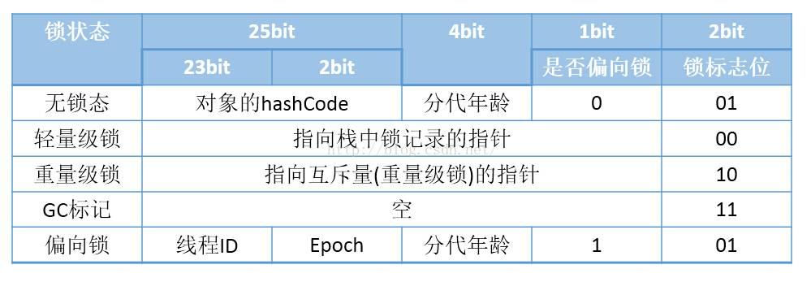
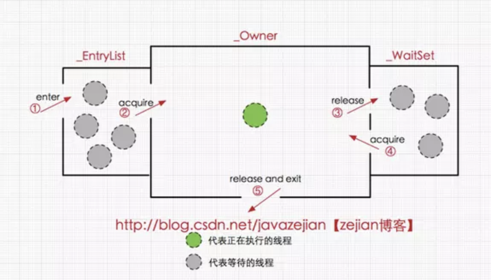
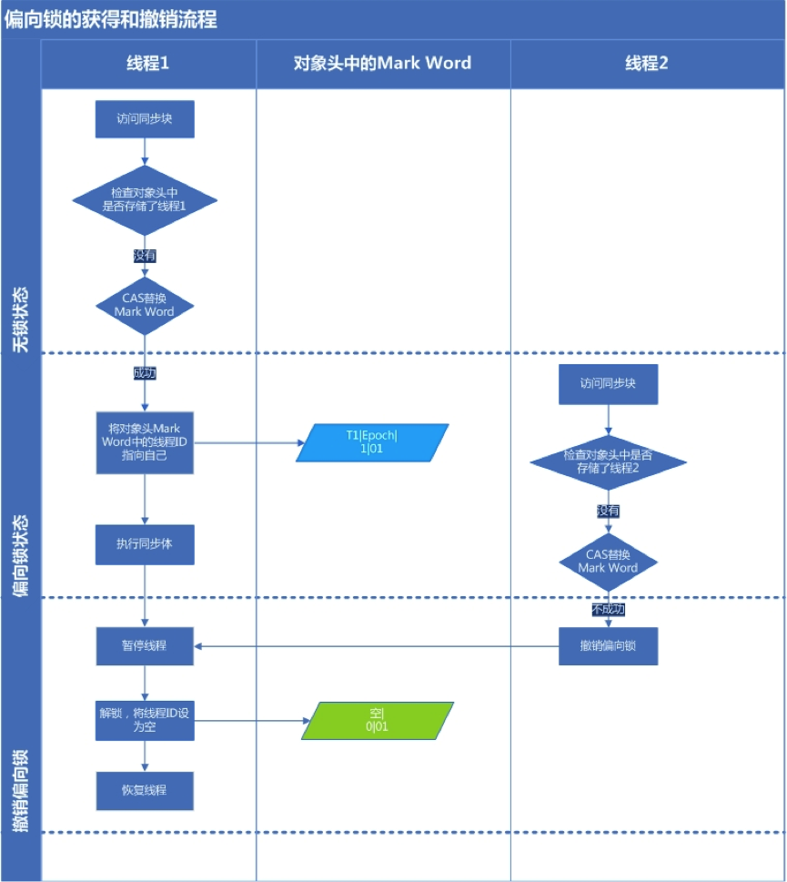
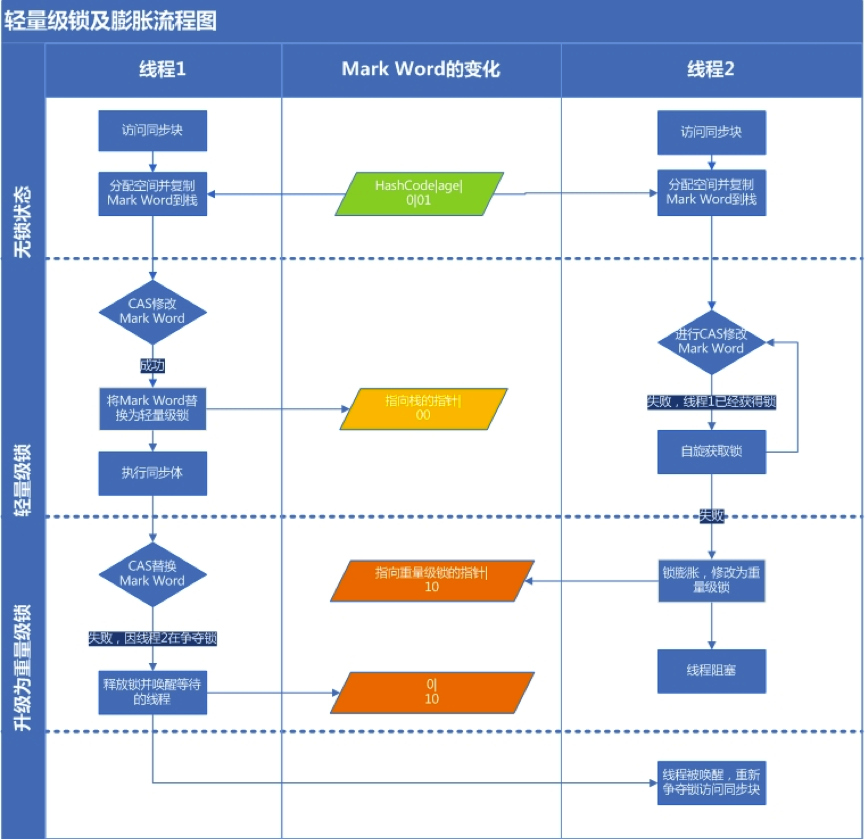
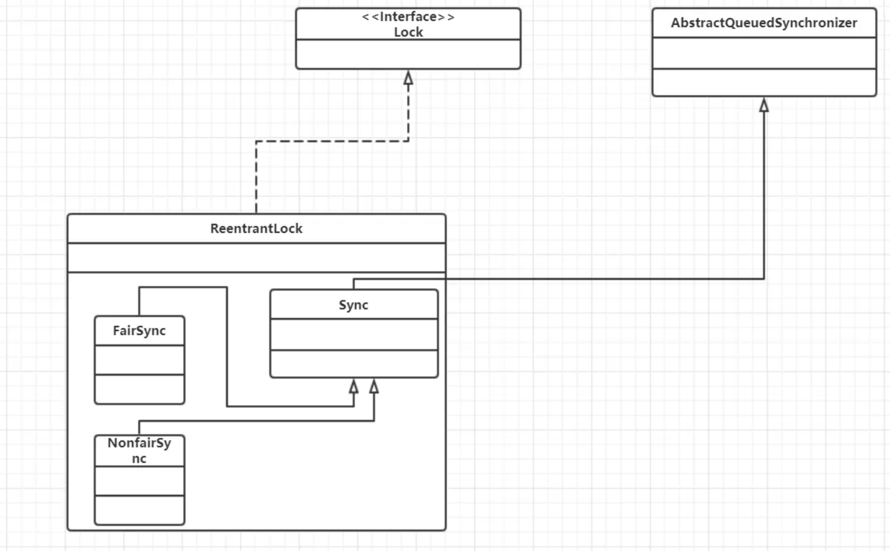

# 面试-并发编程

## 1. syncronized原理

synchronized 是由一对 monitorenter/monitorexit 指令实现的，monitor 对象是同步的基本实现单元。
monitor 的实现完全是依靠操作系统内部的互斥锁Mutex Lock，需要进行用户态到内核态的切换。

> 在JVM中，对象在内存中的布局分为三块区域：对象头、实例变量和填充数据。Hotspot虚拟机的对象头主要包括两部分数据：Mark Word（标记字段）、Klass Pointer（类型指针）。其中Mark Word用于存储对象自身的运行时数据，如哈希码（HashCode）、GC分代年龄、锁状态标志、线程持有的锁、偏向线程 ID、偏向时间戳等等。



关于这两条指令的作用，我们直接参考JVM规范中描述：

monitorenter:
每个对象有一个监视器锁（monitor）。当monitor被占用时就会处于锁定状态，线程执行monitorenter指令时尝试获取monitor的所有权，过程如下：
1、如果monitor的进入数为0，则该线程进入monitor，然后将进入数设置为1，该线程即为monitor的所有者。
2、如果线程已经占有该monitor，只是重新进入，则进入monitor的进入数加1.
3.如果其他线程已经占用了monitor，则该线程进入阻塞状态，直到monitor的进入数为0，再重新尝试获取monitor的所有权。

monitorexit:
执行monitorexit的线程必须是objectref所对应的monitor的所有者。
指令执行时，monitor的进入数减1，如果减1后进入数为0，那线程退出monitor，不再是这个monitor的所有者。其他被这个monitor阻塞的线程可以尝试去获取这个 monitor 的所有权。 

在Java虚拟机(HotSpot)中，monitor是由ObjectMonitor实现的
ObjectMonitor中有两个队列，_WaitSet和_EntryList，用来保存ObjectWaiter对象列表(每个等待锁的线程都会被封装成ObjectWaiter对象)，_owner指向持有ObjectMonitor对象的线程，当多个线程同时访问一段同步代码时，首先会进入 _EntryList 集合，当线程获取到对象的monitor 后进入 _Owner 区域并把monitor中的owner变量设置为当前线程同时monitor中的计数器count加1，若线程调用wait()方法，将释放当前持有的monitor，owner变量恢复为null，count自减1，同时该线程进入WaitSet集合中等待被唤醒。若当前线程执行完毕也将释放monitor(锁)并复位变量的值，以便其他线程进入获取monitor(锁)。如下图所示:



## 2.JVM 对 Java 的原生锁做了哪些优化

monitor是基于底层操作系统的Mutex Lock实现的，而基于Mutex Lock实现的同步必须经历从用户态到核心态的转换，这个开销特别大，成本非常高。所以频繁的通过Synchronized实现同步会严重影响到程序效率，而这种依赖于Mutex Lock实现的锁机制也被称为“重量级锁”，为了减少重量级锁带来的性能开销，JDK1.6对Synchronized进行了种种优化。引入了偏向锁和轻量级锁。

synchronized 锁升级原理：在锁对象的对象头里面有一个 threadid 字段，在第一次访问的时候 threadid 为空，jvm 让其持有偏向锁，并通过CAS将对象头Mark Word中的 threadid 设置为其线程 id，再次进入的时候会先判断 threadid 是否与其线程 id 一致，如果一致则可以直接使用此对象，如果不一致，则升级偏向锁为轻量级锁，通过CAS自旋循环一定次数来获取锁，执行一定次数之后，如果还没有正常获取到要使用的对象，此时就会把锁从轻量级升级为重量级锁，此过程就构成了 synchronized 锁的升级。

偏向所锁，轻量级锁都是乐观锁，重量级锁是悲观锁。

### 2.1 偏向锁



**获取锁**：

1. 检测Mark Word是否为可偏向状态，即是否为偏向锁1，锁标识位为01；
2. 若为可偏向状态，则测试线程ID是否为当前线程ID，如果是，则执行步骤（5），否则执行步骤（3）；
3. 如果线程ID不为当前线程ID，则通过CAS操作竞争锁，竞争成功，则将Mark Word的线程ID替换为当前线程ID，否则执行线程（4）；
4. 通过CAS竞争锁失败，证明当前存在多线程竞争情况，当到达全局安全点，获得偏向锁的线程被挂起，偏向锁升级为轻量级锁，然后被阻塞在安全点的线程继续往下执行同步代码块；
5. 执行同步代码块

**释放锁**： 偏向锁的释放采用了一种只有竞争才会释放锁的机制，线程是不会主动去释放偏向锁，需要等待其他线程来竞争。偏向锁的撤销需要等待全局安全点（这个时间点是上没有正在执行的代码）。其步骤如下：

1. 暂停拥有偏向锁的线程，判断锁对象石是否还处于被锁定状态；
2. 撤销偏向苏，恢复到无锁状态（01）或者轻量级锁的状态；

### 2.2 轻量级锁



**获取锁**：

1. 判断当前对象是否处于无锁状态（hashcode、0、01），若是，则JVM首先将在当前线程的栈帧中建立一个名为锁记录（Lock Record）的空间，用于存储锁对象目前的Mark Word的拷贝（官方把这份拷贝加了一个Displaced前缀，即Displaced Mark Word）；否则执行步骤（3）；
2. JVM利用CAS操作尝试将对象的Mark Word更新为指向Lock Record的指正，如果成功表示竞争到锁，则将锁标志位变成00（表示此对象处于轻量级锁状态），执行同步操作；如果失败则执行步骤（3）；
3. 判断当前对象的Mark Word是否指向当前线程的栈帧，如果是则表示当前线程已经持有当前对象的锁，则直接执行同步代码块；否则只能说明该锁对象已经被其他线程抢占了，这时轻量级锁需要膨胀为重量级锁，锁标志位变成10，后面等待的线程将会进入阻塞状态；

**释放锁**： 轻量级锁的释放也是通过CAS操作来进行的，主要步骤如下：

1. 取出在获取轻量级锁保存在Displaced Mark Word中的数据；
2. 用CAS操作将取出的数据替换当前对象的Mark Word中，如果成功，则说明释放锁成功，否则执行（3）；
3. 如果CAS操作替换失败，说明有其他线程尝试获取该锁，则需要在释放锁的同时需要唤醒被挂起的线程。

### 2.3 锁膨胀过程


## 3. ReenTrantLock

ReentrantLock就是通过重写了AQS的tryAcquire和tryRelease方法实现的lock和unlock



首先ReentrantLock继承自父类Lock，然后有3个内部类，其中Sync内部类继承自AQS，另外的两个内部类继承自Sync，这两个类分别是用来**公平锁和非公平锁**的。

通过Sync重写的方法tryAcquire、tryRelease可以知道，ReentrantLock实现的是AQS的独占模式，也就是独占锁，这个锁是悲观锁。

### 3.1 非公平锁的实现原理

**lock方法获取锁**

```java
final void lock() {
    //CAS操作设置state的值
    if (compareAndSetState(0, 1))
        //设置成功 直接将锁的所有者设置为当前线程 流程结束
        setExclusiveOwnerThread(Thread.currentThread());
    else
        //设置失败 则进行后续的加入同步队列准备
        acquire(1);
}

public final void acquire(int arg) {
    //调用子类重写的tryAcquire方法 如果tryAcquire方法返回false 那么线程就会进入同步队列。这里会有疑问，同步队列的线程后续如何抢占锁呢？请看AQS
    if (!tryAcquire(arg) &&
        acquireQueued(addWaiter(Node.EXCLUSIVE), arg))
        selfInterrupt();
}

//子类重写的tryAcquire方法
protected final boolean tryAcquire(int acquires) {
    //调用nonfairTryAcquire方法
    return nonfairTryAcquire(acquires);
}

final boolean nonfairTryAcquire(int acquires) {
    final Thread current = Thread.currentThread();
    int c = getState();
    //如果状态state=0，即在这段时间内 锁的所有者把锁释放了 那么这里state就为0
    if (c == 0) {
        //使用CAS操作设置state的值
        if (compareAndSetState(0, acquires)) {
            //操作成功 则将锁的所有者设置成当前线程 且返回true，也就是当前线程不会进入同步
            //队列。
            setExclusiveOwnerThread(current);
            return true;
        }
    }
    //如果状态state不等于0，也就是有线程正在占用锁，那么先检查一下这个线程是不是自己
    else if (current == getExclusiveOwnerThread()) {
        //如果线程就是自己了，那么直接将state+1，返回true，不需要再获取锁 因为锁就在自己
        //身上了。
        int nextc = c + acquires;
        if (nextc < 0) // overflow
            throw new Error("Maximum lock count exceeded");
        setState(nextc);
        return true;
    }
    //如果state不等于0，且锁的所有者又不是自己，那么线程就会进入到同步队列。
    return false;
}

```


**tryRelease锁的释放**

```java
public void unlock() {
    sync.release(1);
}

public final boolean release(int arg) {
    //子类重写的tryRelease方法，需要等锁的state=0，即tryRelease返回true的时候，才会去唤醒其
    //它线程进行尝试获取锁。
    if (tryRelease(arg)) {
        Node h = head;
        if (h != null && h.waitStatus != 0)
            unparkSuccessor(h);
        return true;
    }
    return false;
}
    
protected final boolean tryRelease(int releases) {
    //状态的state减去releases
    int c = getState() - releases;
    //判断锁的所有者是不是该线程
    if (Thread.currentThread() != getExclusiveOwnerThread())
        //如果所的所有者不是该线程 则抛出异常 也就是锁释放的前提是线程拥有这个锁，
        throw new IllegalMonitorStateException();
    boolean free = false;
    //如果该线程释放锁之后 状态state=0，即锁没有重入，那么直接将将锁的所有者设置成null
    //并且返回true，即代表可以唤醒其他线程去获取锁了。如果该线程释放锁之后state不等于0，
    //那么代表锁重入了，返回false，代表锁还未正在释放，不用去唤醒其他线程。
    if (c == 0) {
        free = true;
        setExclusiveOwnerThread(null);
    }
    setState(c);
    return free;
}
```

### 3.2 公平锁实现原理

**lock方法获取锁**

1. 获取状态的state的值，如果state=0即代表锁没有被其它线程占用(但是并不代表同步队列没有线程在等待)，执行步骤2。如果state!=0则代表锁正在被其它线程占用，执行步骤3。
2. 判断同步队列是否存在线程(节点)，如果不存在则直接将锁的所有者设置成当前线程，且更新状态state，然后返回true。
3. 判断锁的所有者是不是当前线程，如果是则更新状态state的值，然后返回true，如果不是，那么返回false，即线程会被加入到同步队列中

```java
final void lock() {
    acquire(1);
}

public final void acquire(int arg) {
    //同步队列中有线程 且 锁的所有者不是当前线程那么将线程加入到同步队列的尾部，
    //保证了公平性，也就是先来的线程先获得锁，后来的不能抢先获取。
    if (!tryAcquire(arg) &&
        acquireQueued(addWaiter(Node.EXCLUSIVE), arg))
        selfInterrupt();
}

protected final boolean tryAcquire(int acquires) {
    final Thread current = Thread.currentThread();
    int c = getState();
    //判断状态state是否等于0，等于0代表锁没有被占用，不等于0则代表锁被占用着。
    if (c == 0) {
        //调用hasQueuedPredecessors方法判断同步队列中是否有线程在等待，如果同步队列中没有
        //线程在等待 则当前线程成为锁的所有者，如果同步队列中有线程在等待，则继续往下执行
        //这个机制就是公平锁的机制，也就是先让先来的线程获取锁，后来的不能抢先获取。
        if (!hasQueuedPredecessors() &&
            compareAndSetState(0, acquires)) {
            setExclusiveOwnerThread(current);
            return true;
        }
    }
    //判断当前线程是否为锁的所有者，如果是，那么直接更新状态state，然后返回true。
    else if (current == getExclusiveOwnerThread()) {
        int nextc = c + acquires;
        if (nextc < 0)
            throw new Error("Maximum lock count exceeded");
        setState(nextc);
        return true;
    }
    //如果同步队列中有线程存在 且 锁的所有者不是当前线程，则返回false。
    return false;
}
```


## 4. ReentrantLock和Syncronized比较

|                     | ReentrantLock  | Synchronized                                                 |
| ------------------- | -------------- | :----------------------------------------------------------- |
| 底层实现            | 通过AQS实现    | 通过JVM实现，其中synchronized又有多个类型的锁，除了重量级锁是通过monitor对象(操作系统mutex互斥原语)实现外，其它类型的通过对象头实现。 |
| 是否可重入          | 是             | 是                                                           |
| 公平锁              | 是             | 否                                                           |
| 非公平锁            | 是             | 是                                                           |
| 锁的类型            | 悲观锁、显式锁 | 悲观锁、隐式锁(内置锁)                                       |
| 是否支持中断        | 是             | 否                                                           |
| 是否支持超时等待    | 是             | 否                                                           |
| 是否自动获取/释放锁 | 否             | 是                                                           |