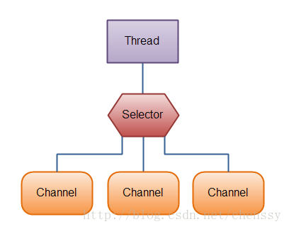

# 面试题-NIO


## **NIO编程实现步骤**



服务端步骤

- 第一步：创建Selector
- 第二步：创建ServerSocketChannel,并绑定监听端口
- 第三步：将Channel设置为非阻塞模式
- 第四步：将Channel注册到Selector上，监听连接事件
- 第五步：循环调用Selector的select方法，检测就绪情况
- 第六步：调用SelectedKeys方法获取就绪channel集合
- 第七步： 判断就绪事件种类，调用业务处理方法
- 第八步：根据业务需要决定是否再次注册监听事件，重复执行第三步操作

客户端步骤

- 连接服务器端
- 向服务器端发送数据
- 接收服务器端的响应


## 代码示例

服务端

```
public class NIOServer {

    /*接受数据缓冲区*/
    private ByteBuffer sendbuffer = ByteBuffer.allocate(1024);
    /*发送数据缓冲区*/
    private  ByteBuffer receivebuffer = ByteBuffer.allocate(1024);

    private Selector selector;

    public NIOServer(int port) throws IOException {
        // 打开服务器套接字通道
        ServerSocketChannel serverSocketChannel = ServerSocketChannel.open();
        // 服务器配置为非阻塞
        serverSocketChannel.configureBlocking(false);
        // 检索与此通道关联的服务器套接字
        ServerSocket serverSocket = serverSocketChannel.socket();
        // 进行服务的绑定
        serverSocket.bind(new InetSocketAddress(port));
        // 通过open()方法找到Selector
        selector = Selector.open();
        // 注册到selector，等待连接
        serverSocketChannel.register(selector, SelectionKey.OP_ACCEPT);
        System.out.println("Server Start----:");
    }

    //
    private void listen() throws IOException {
        while (true) {
            selector.select();
            Set<SelectionKey> selectionKeys = selector.selectedKeys();
            Iterator<SelectionKey> iterator = selectionKeys.iterator();
            while (iterator.hasNext()) {
                SelectionKey selectionKey = iterator.next();
                iterator.remove();
                handleKey(selectionKey);
            }
        }
    }

    private void handleKey(SelectionKey selectionKey) throws IOException {
        // 接受请求
        ServerSocketChannel server = null;
        SocketChannel client = null;
        String receiveText;
        String sendText;
        int count=0;
        // 测试此键的通道是否已准备好接受新的套接字连接。
        if (selectionKey.isAcceptable()) {
            // 返回为之创建此键的通道。
            server = (ServerSocketChannel) selectionKey.channel();
            // 接受到此通道套接字的连接。
            // 此方法返回的套接字通道（如果有）将处于阻塞模式。
            client = server.accept();
            // 配置为非阻塞
            client.configureBlocking(false);
            // 注册到selector，等待连接
            client.register(selector, SelectionKey.OP_READ);
        } else if (selectionKey.isReadable()) {
            // 返回为之创建此键的通道。
            client = (SocketChannel) selectionKey.channel();
            //将缓冲区清空以备下次读取
            receivebuffer.clear();
            //读取服务器发送来的数据到缓冲区中
            count = client.read(receivebuffer);
            if (count > 0) {
                receiveText = new String( receivebuffer.array(),0,count);
                System.out.println("服务器端接受客户端数据--:"+receiveText);
                client.register(selector, SelectionKey.OP_WRITE);
            }
        } else if (selectionKey.isWritable()) {
            //将缓冲区清空以备下次写入
            sendbuffer.clear();
            // 返回为之创建此键的通道。
            client = (SocketChannel) selectionKey.channel();
            sendText="message from server--";
            //向缓冲区中输入数据
            sendbuffer.put(sendText.getBytes());
            //将缓冲区各标志复位,因为向里面put了数据标志被改变要想从中读取数据发向服务器,就要复位
            sendbuffer.flip();
            //输出到通道
            client.write(sendbuffer);
            System.out.println("服务器端向客户端发送数据--："+sendText);
            client.register(selector, SelectionKey.OP_READ);
        }
    }

    /**
    * @param args
    * @throws IOException
    */
    public static void main(String[] args) throws IOException {
        int port = 8080;
        NIOServer server = new NIOServer(port);
        server.listen();
    }
}
```


客户端

```
public class NIOClient {
    /*接受数据缓冲区*/
    private static ByteBuffer sendbuffer = ByteBuffer.allocate(1024);
    /*发送数据缓冲区*/
    private static ByteBuffer receivebuffer = ByteBuffer.allocate(1024);

    public static void main(String[] args) throws IOException {
        // 打开socket通道
        SocketChannel socketChannel = SocketChannel.open();
        // 设置为非阻塞方式
        socketChannel.configureBlocking(false);
        // 打开选择器
        Selector selector = Selector.open();
        // 注册连接服务端socket动作
        socketChannel.register(selector, SelectionKey.OP_CONNECT);
        // 连接
        socketChannel.connect(new InetSocketAddress("127.0.0.1", 8080));

        Set<SelectionKey> selectionKeys;
        Iterator<SelectionKey> iterator;
        SelectionKey selectionKey;
        SocketChannel client;
        String receiveText;
        String sendText;
        int count=0;

        while (true) {
            //选择一组键，其相应的通道已为 I/O 操作准备就绪。
            //此方法执行处于阻塞模式的选择操作。
            selector.select();
            //返回此选择器的已选择键集。
            selectionKeys = selector.selectedKeys();
            //System.out.println(selectionKeys.size());
            iterator = selectionKeys.iterator();
            while (iterator.hasNext()) {
                selectionKey = iterator.next();
                if (selectionKey.isConnectable()) {
                    System.out.println("client connect");
                    client = (SocketChannel) selectionKey.channel();
                    // 判断此通道上是否正在进行连接操作。
                    // 完成套接字通道的连接过程。
                    if (client.isConnectionPending()) {
                        client.finishConnect();
                        System.out.println("完成连接!");
                        sendbuffer.clear();
                        sendbuffer.put("Hello,Server".getBytes());
                        sendbuffer.flip();
                        client.write(sendbuffer);
                    }
                    client.register(selector, SelectionKey.OP_READ);
                } else if (selectionKey.isReadable()) {
                    client = (SocketChannel) selectionKey.channel();
                    //将缓冲区清空以备下次读取
                    receivebuffer.clear();
                    //读取服务器发送来的数据到缓冲区中
                    count=client.read(receivebuffer);
                    if(count>0){
                        receiveText = new String( receivebuffer.array(),0,count);
                        System.out.println("客户端接受服务器端数据--:"+receiveText);
                        client.register(selector, SelectionKey.OP_WRITE);
                    }

                } else if (selectionKey.isWritable()) {
                    sendbuffer.clear();
                    client = (SocketChannel) selectionKey.channel();
                    sendText = "message from client--";
                    sendbuffer.put(sendText.getBytes());
                    //将缓冲区各标志复位,因为向里面put了数据标志被改变要想从中读取数据发向服务器,就要复位
                    sendbuffer.flip();
                    client.write(sendbuffer);
                    System.out.println("客户端向服务器端发送数据--："+sendText);
                    client.register(selector, SelectionKey.OP_READ);
                }
            }
            selectionKeys.clear();
        }
    }
}
```

