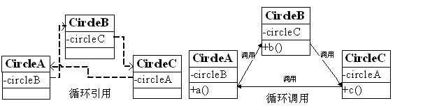
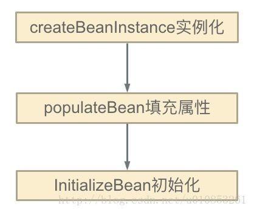

# 面试题-Spring


## 1. Spring中的Bean是线程安全的吗？

Spring框架里的Bean，默认为单例模式。

对于单例Bean,所有线程都共享一个单例实例Bean,因此是存在资源的竞争。

如果单例Bean,是一个无状态Bean，也就是线程中的操作不会对Bean的成员执行查询以外的操作，那么这个单例Bean是线程安全的。比如Spring mvc 的 Controller、Service、Dao等，这些Bean大多是无状态的，只关注于方法本身。

对于有状态的bean，最浅显的解决办法就是将多态bean的作用域由“singleton”变更为“prototype”。Spring官方提供的bean，一般提供了通过ThreadLocal去解决线程安全的方法，比如RequestContextHolder、TransactionSynchronizationManager、LocaleContextHolder等。


# 2. Spring-bean的循环依赖

### 何为循环依赖



就是这样：A、B、C 之间相互依赖。


### 造成的问题

来一串代码说明问题

```java
public class A {
    private B b;
}

public class B {
    private A a;
}
/**********************/
<bean id="beanA" class="xyz.coolblog.BeanA">
    <property name="beanB" ref="beanB"/>
</bean>
<bean id="beanB" class="xyz.coolblog.BeanB">
    <property name="beanA" ref="beanA"/>
</bean>
```

IOC 按照上面所示的 <bean> 配置，实例化 A 的时候发现 A 依赖于 B 于是去实例化 B（此时 A 创建未结束，处于创建中的状态），而发现 B 又依赖于 A ，于是就这样循环下去，最终导致 OOM。


### 循环依赖发生的时机

Bean 实例化主要分为三步，如图：



问题出现在：第一步和第二步的过程中，也就是填充属性 / 方法的过程中。


### Spring 如何解决的

- Spring 为了解决单例的循环依赖问题，使用了 **三级缓存** ，递归调用时发现 Bean 还在创建中即为循环依赖
- 单例模式的 Bean 保存在如下的数据结构中：

```java
/** 一级缓存：用于存放完全初始化好的 bean **/
private final Map<String, Object> singletonObjects = new ConcurrentHashMap<String, Object>(256);

/** 二级缓存：存放原始的 bean 对象（尚未填充属性），用于解决循环依赖 */
private final Map<String, Object> earlySingletonObjects = new HashMap<String, Object>(16);

/** 三级级缓存：存放 bean 工厂对象，用于解决循环依赖 */
private final Map<String, ObjectFactory<?>> singletonFactories = new HashMap<String, ObjectFactory<?>>(16);

/**
bean 的获取过程：先从一级获取，失败再从二级、三级里面获取

创建中状态：是指对象已经 new 出来了但是所有的属性均为 null 等待被 init
*/
```

检测循环依赖的过程如下：

- A 创建过程中需要 B，于是 **A 将自己放到三级缓里面** ，去实例化 B

- B 实例化的时候发现需要 A，于是 B 先查一级缓存，没有，再查二级缓存，还是没有，再查三级缓存，找到了！

- - **然后把三级缓存里面的这个 A 放到二级缓存里面，并删除三级缓存里面的 A**
  - B 顺利初始化完毕，**将自己放到一级缓存里面**（此时B里面的A依然是创建中状态）

- 然后回来接着创建 A，此时 B 已经创建结束，直接从一级缓存里面拿到 B ，然后完成创建，**并将自己放到一级缓存里面**

- 如此一来便解决了循环依赖的问题

```java
// 以上叙述的源代码
protected Object getSingleton(String beanName, boolean allowEarlyReference) {
    Object singletonObject = this.singletonObjects.get(beanName);
    if (singletonObject == null && isSingletonCurrentlyInCreation(beanName)) {
        synchronized (this.singletonObjects) {
            singletonObject = this.earlySingletonObjects.get(beanName);
            if (singletonObject == null && allowEarlyReference) {
                ObjectFactory<?> singletonFactory = this.singletonFactories.get(beanName);
                if (singletonFactory != null) {
                    singletonObject = singletonFactory.getObject();
                    this.earlySingletonObjects.put(beanName, singletonObject);
                    this.singletonFactories.remove(beanName);
                }
            }
        }
    }
    return (singletonObject != NULL_OBJECT ? singletonObject : null);
}
```

参考[bean循环依赖](http://www.justdojava.com/2019/06/22/spring-analysis-note-5/)

